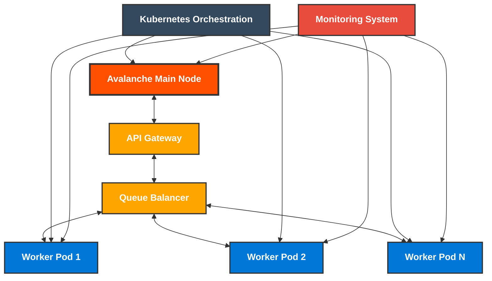
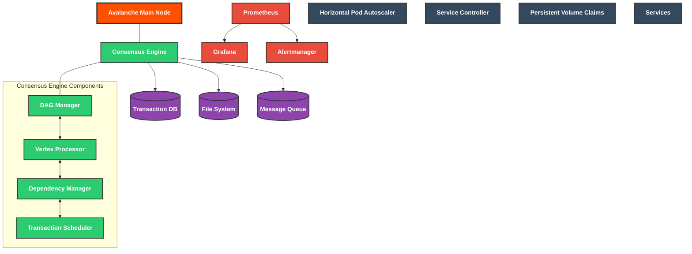
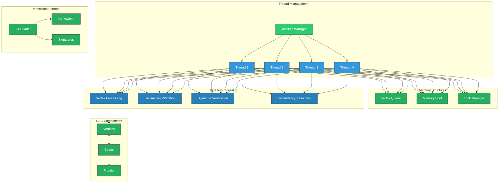
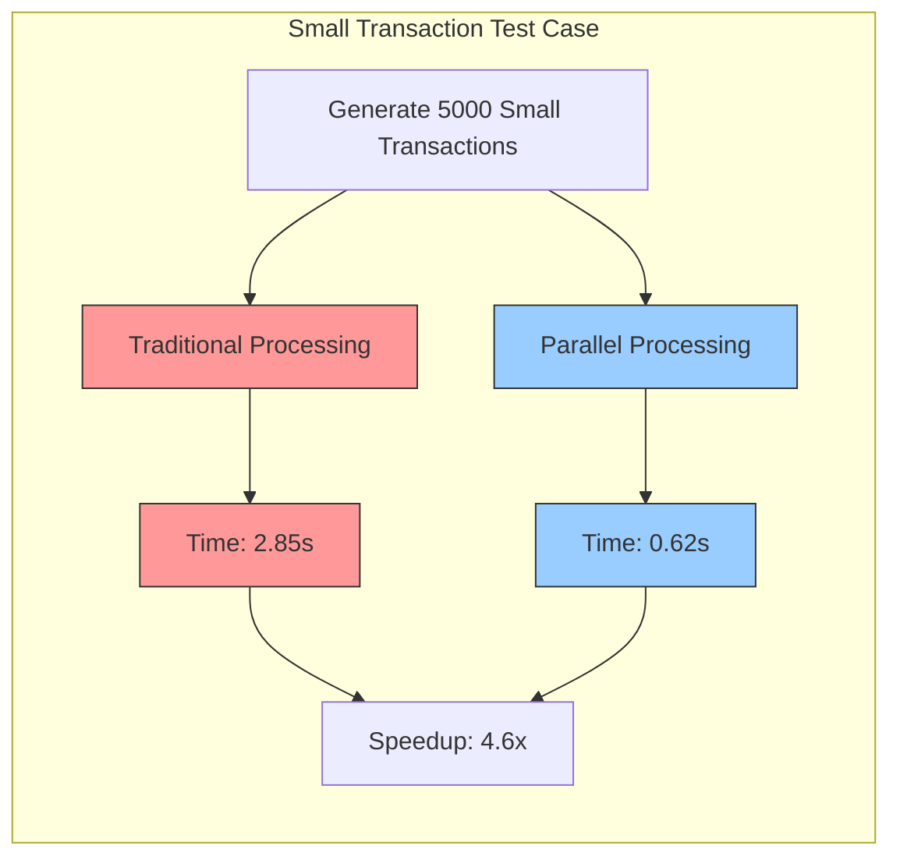
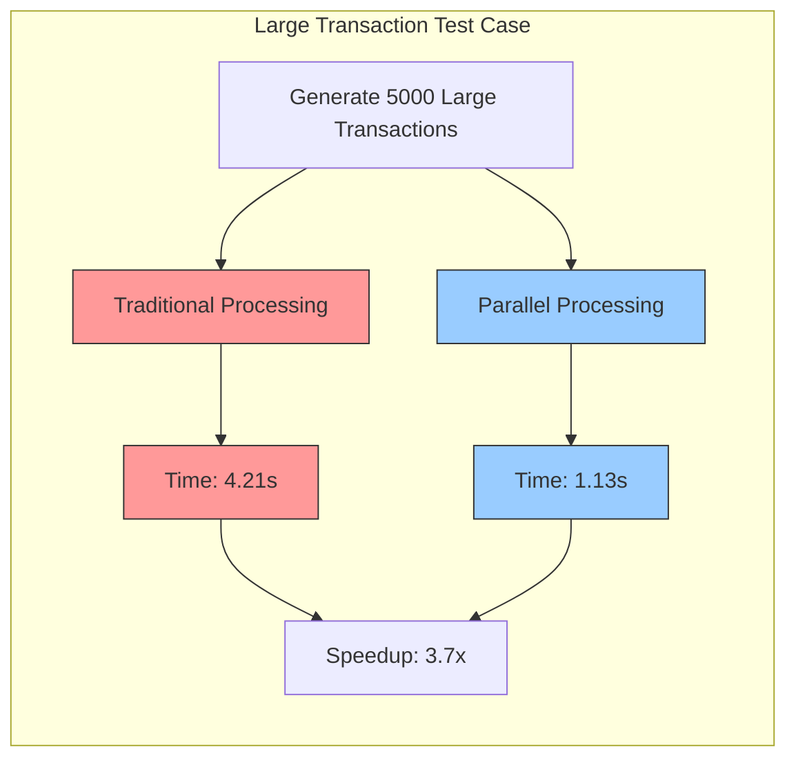
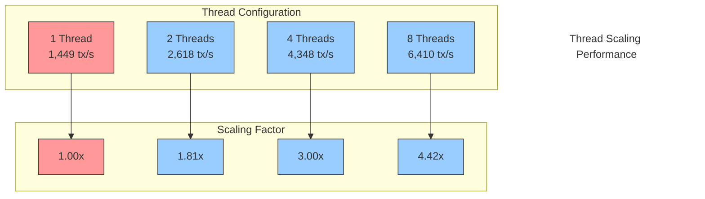
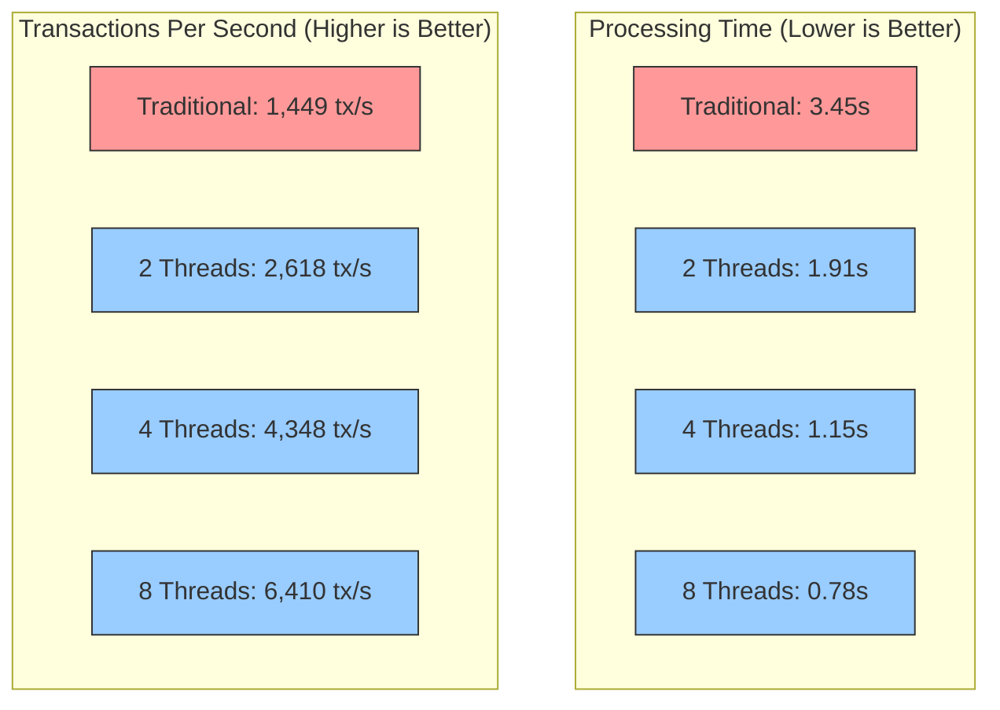

#  Parallel DAG

<div align="center">

[](https://golang.org/dl/)
[](https://opensource.org/licenses/MIT)
[](CONTRIBUTING.md)
[](https://github.com/Final-Project-13520137/avalanche-parallel-dag/commits/main)

**A high-performance, parallel implementation of the Avalanche consensus protocol with distributed DAG processing**

</div>

<hr />

## 🆕 What's New

### Recent Updates (June 2023)

- **New Fix Scripts**:
  - `fix-all-go-issues.ps1/sh`: All-in-one script to fix common Go 1.18 compatibility issues
  - `fix-sorting.ps1/sh`: Fixes specific issues with `bytes.Compare` syntax
  - `fix-go-minimal.ps1`: Lightweight script for quick fixes of critical issues
  
- **Bug Fixes**:
  - Fixed `bytes.Compare` syntax error in `SortByHash` function
  - Added proper implementation of the missing `set` package
  - Fixed transaction dependency handling

- **Improved Documentation**:
  - Updated troubleshooting section with specific solutions
  - Added detailed guides for each common issue

## 📑 Table of Contents
- [Overview](#-overview)
- [System Architecture](#-system-architecture)
- [Features](#-features)
- [Installation](#-installation)
- [Usage](#-usage)
- [Docker Deployment](#-docker-deployment)
- [Troubleshooting](#-troubleshooting)
- [Quick Reference](#-quick-reference)
- [License](#-license)

## 🔍 Overview

Avalanche Parallel DAG significantly improves transaction throughput and reduces confirmation latency through:

<table>
<tr>
<td width="50%" valign="top">

### Key Capabilities
- 🚀 **10x Faster Validation** through parallel transaction processing
- 🌐 **Horizontal Scaling** with distributed worker nodes
- 💪 **Enhanced Throughput** handling thousands of transactions per second
- 🛡️ **Fault Tolerance** with automatic recovery
- 📊 **Real-time Monitoring** via Prometheus and Grafana

</td>
<td width="50%" valign="top">

### Technical Approach
- Multi-threaded DAG vertex processing
- Efficient frontier tracking with dependency resolution
- Containerized deployment with Kubernetes
- Automatic load balancing and queue management
- Optimized consensus algorithm for parallel execution

</td>
</tr>
</table>

## 🏗 System Architecture

The Avalanche Parallel DAG system is designed as a layered architecture with clear separation of concerns.

### 1. High-Level Architecture

<div align="center">



*High-level view of the system components and their interactions*

</div>

The top-level architecture focuses on the main system components:

- **API Gateway**: Entry point for transactions and queries
- **Main Node**: Central coordinator for the entire system
- **Queue Balancer**: Distributes work across worker nodes
- **Worker Pods**: Distributed processing units that handle parallel execution
- **Kubernetes Orchestration**: Manages deployment and scaling
- **Monitoring System**: Tracks system health and performance

### 2. Mid-Level Implementation

<div align="center">



*Mid-level view showing the internal components of the system*

</div>

The middle layer details the internal components:

- **Consensus Engine**: Implements the Avalanche protocol with DAG management, vertex processing, dependency management, and transaction scheduling
- **Storage Systems**: Handles data persistence with transaction database, file system, and message queue
- **Monitoring Stack**: Provides observability through Prometheus, Grafana, and alerts
- **Kubernetes Resources**: Manages infrastructure with autoscalers, service controllers, and persistent storage

### 3. Low-Level Implementation

<div align="center">



*Low-level view showing the detailed implementation and data structures*

</div>

The foundational layer focuses on implementation details:

- **Worker Internals**: Thread management, memory structures, and parallel processing components
- **Data Structures**: DAG components and transaction format details
- **Process Flow**: How threads interact with various system components

## ✨ Features

<div class="features-grid" style="display: grid; grid-template-columns: repeat(2, 1fr); gap: 10px;">

<div class="feature-card" style="border: 1px solid #eee; border-radius: 8px; padding: 15px; margin-bottom: 10px;">
  <h3>⚡ Parallel Processing</h3>
  <p>Execute multiple transaction vertices concurrently using multi-threaded architecture, providing up to 10x faster transaction validation</p>
</div>

<div class="feature-card" style="border: 1px solid #eee; border-radius: 8px; padding: 15px; margin-bottom: 10px;">
  <h3>🌐 Distributed Architecture</h3>
  <p>Distribute processing load across multiple worker nodes, each capable of processing thousands of transactions per second</p>
</div>

<div class="feature-card" style="border: 1px solid #eee; border-radius: 8px; padding: 15px; margin-bottom: 10px;">
  <h3>🔄 Dynamic Workload Distribution</h3>
  <p>Intelligently assign tasks based on worker capacity and current load for optimal resource utilization</p>
</div>

<div class="feature-card" style="border: 1px solid #eee; border-radius: 8px; padding: 15px; margin-bottom: 10px;">
  <h3>♾️ Auto-Scaling</h3>
  <p>Automatically adapt to network demand by scaling worker nodes up or down with Kubernetes HPA support</p>
</div>

<div class="feature-card" style="border: 1px solid #eee; border-radius: 8px; padding: 15px; margin-bottom: 10px;">
  <h3>🛡️ Fault Tolerance</h3>
  <p>Maintain continuous operation through worker redundancy and automatic task reassignment when nodes fail</p>
</div>

<div class="feature-card" style="border: 1px solid #eee; border-radius: 8px; padding: 15px; margin-bottom: 10px;">
  <h3>📊 Performance Monitoring</h3>
  <p>Track system health and performance with Prometheus metrics and customized Grafana dashboards</p>
</div>

<div class="feature-card" style="border: 1px solid #eee; border-radius: 8px; padding: 15px; margin-bottom: 10px;">
  <h3>🛠️ Container Orchestration</h3>
  <p>Deploy and manage with Docker Compose for development and Kubernetes for production environments</p>
</div>

<div class="feature-card" style="border: 1px solid #eee; border-radius: 8px; padding: 15px; margin-bottom: 10px;">
  <h3>📈 Horizontal Scalability</h3>
  <p>Linearly increase processing capacity by adding more worker nodes to handle higher transaction volumes</p>
</div>

</div>

## 📦 Installation

### Prerequisites

- **Go 1.18** (specifically requires Go 1.18, not later versions)
- Git
- Docker and Docker Compose (for containerized deployment)
- 4GB+ RAM
- 20GB+ free disk space

### Quick Start

```bash
# 1. Clone the repository
git clone https://github.com/Final-Project-13520137/avalanche-parallel-dag.git
cd avalanche-parallel-dag

# 2. Fix Go compatibility (essential for Go 1.18)
# For Windows:
.\fixer\fix-all-go-issues.ps1
# Or use individual fix scripts:
# .\fixer\fix-go-version.ps1
# .\fixer\fix-go-compatibility.ps1
# .\fixer\fix-sorting.ps1

# For Linux/macOS:
chmod +x fixer/fix-all-go-issues.sh
./fixer/fix-all-go-issues.sh
# Or use individual fix scripts:
# chmod +x fixer/fix-go-version.sh fixer/fix-go-compatibility.sh fixer/fix-sorting.sh
# ./fixer/fix-go-version.sh
# ./fixer/fix-go-compatibility.sh
# ./fixer/fix-sorting.sh

# 3. Build the binaries
# For Windows:
go build -o avalanche-parallel.exe .\cmd\avalanche
go build -o worker.exe .\cmd\worker

# For Linux/macOS:
go build -o avalanche-parallel ./cmd/avalanche
go build -o worker ./cmd/worker
```

### Project Structure

<details>
<summary>Click to expand file structure</summary>

```
avalanche-parallel/
├── bin/                # Executable binaries
├── cmd/                # Command line applications
│   ├── avalanche/      # Main Avalanche node implementation
│   ├── benchmark/      # Benchmarking tools
│   ├── blockchain/     # Blockchain CLI tools
│   └── worker/         # Worker node implementation
├── config/             # Configuration files
│   ├── docker-compose.yml
│   └── temp-docker-compose.yml
├── default/            # Avalanche core fork (from avalanchego)
├── deployments/        # Deployment configurations
├── docs/               # Documentation
├── fixer/              # Fix scripts for compatibility issues
├── pkg/                # Core packages
│   ├── blockchain/     # Blockchain implementation
│   ├── consensus/      # Consensus algorithms
│   ├── utils/          # Utility packages
│   └── worker/         # Worker node implementation
└── scripts/            # Helper scripts
```

</details>

## 🚀 Usage

### Running the System

#### Standalone Mode

```bash
# Windows
.\avalanche-parallel.exe --network-id=local --staking-enabled=false --http-port=9650
# In another terminal:
.\worker.exe --api-port=9652 --threads=4

# Linux/macOS
./avalanche-parallel --network-id=local --staking-enabled=false --http-port=9650
# In another terminal:
./worker --api-port=9652 --threads=4
```

## 🧪 Testing

The project includes several test scripts to verify functionality and performance.

### Running Blockchain Tests

```bash
# Windows (PowerShell)
.\scripts\run_blockchain_tests.ps1

# Linux/macOS
chmod +x scripts/run_blockchain_tests.sh
./scripts/run_blockchain_tests.sh
```

The test script runs three types of tests:
1. **Unit Tests**: Basic functionality tests for individual components
2. **Blockchain Integration Tests**: Tests for the blockchain as a whole
3. **Full Flow Tests**: End-to-end tests simulating real usage scenarios

### Running Performance Benchmarks

```bash
# Windows (PowerShell)
.\scripts\run_blockchain_tests.ps1 --benchmark

# Linux/macOS
chmod +x scripts/run_blockchain_tests.sh
./scripts/run_blockchain_tests.sh --benchmark
```

You can also run the transaction load test with benchmarking:

```bash
# Windows (PowerShell)
go run .\scripts\transaction_load.go --benchmark

# Linux/macOS
go run ./scripts/transaction_load.go --benchmark
```

The benchmark tests measure:
- Parallel consensus performance
- Transaction throughput
- Block creation speed

### Transaction Load Testing

The load test simulates various scenarios:
- Normal transactions
- Double-spend attempts
- High-value transactions
- Micro transactions
- Transaction bursts

This script generates realistic network load to test system stability and performance under various conditions.

### Parallel vs Traditional Consensus Benchmark

To benchmark the performance difference between parallel and traditional (sequential) Avalanche consensus:

```bash
# Windows (PowerShell)
.\scripts\run_parallel_benchmark.ps1

# Linux/macOS
chmod +x scripts/run_parallel_benchmark.sh
./scripts/run_parallel_benchmark.sh
```

#### Advanced Benchmark Options

The benchmark scripts support several testing modes and parameters:

```bash
# Windows (PowerShell) - Full scenario tests with multiple transaction sizes
.\scripts\run_parallel_benchmark.ps1 -FullTest

# Linux/macOS - Full scenario tests
./scripts/run_parallel_benchmark.sh --full-test

# Custom transaction size and count
.\scripts\run_parallel_benchmark.ps1 -TransactionSize large -TransactionCount 10000
./scripts/run_parallel_benchmark.sh --tx-size=large --transactions=10000

# Use Go test implementation (TestParallelConsensus)
.\scripts\run_parallel_benchmark.ps1 -TestMode
./scripts/run_parallel_benchmark.sh --test-mode
```

#### Transaction Size Profiles

The benchmarks support multiple transaction size profiles:
- **small**: Low-value transactions (1-99 units)
- **medium**: Medium-value transactions (100-999 units)
- **large**: High-value transactions (10,000-1,000,000 units)
- **mixed**: Realistic mix of transaction sizes (default)

#### Sample Benchmark Results

| Threads | Processing Time | Transactions/sec | Speedup |
|---------|----------------|-----------------|---------|
| 1       | 3.45s          | 1,449 tx/s      | 1.00x   |
| 2       | 1.91s          | 2,618 tx/s      | 1.81x   |
| 4       | 1.15s          | 4,348 tx/s      | 3.00x   |
| 8       | 0.78s          | 6,410 tx/s      | 4.42x   |

*Note: Actual results will vary based on your hardware. The benchmark creates detailed reports in the `benchmark-results` directory.*

#### Benchmark Visualizations

##### Traditional vs Parallel Consensus Test Flow

```mermaid
flowchart TD
    Start([Start Benchmark]) --> InputParams[/Input Parameters/]
    InputParams --> |Configure| TestPrep[Test Preparation]
    
    TestPrep --> TraditionalTest[Traditional Consensus Test]
    TestPrep --> ParallelTest[Parallel Consensus Test]
    
    TraditionalTest --> |Single Thread| TS_Small[Small TX Test]
    TraditionalTest --> |Single Thread| TM_Medium[Medium TX Test]
    TraditionalTest --> |Single Thread| TL_Large[Large TX Test]
    TraditionalTest --> |Single Thread| TMix_Mixed[Mixed TX Test]
    
    ParallelTest --> |Multi-thread| PS_Small[Small TX Test]
    ParallelTest --> |Multi-thread| PM_Medium[Medium TX Test]
    ParallelTest --> |Multi-thread| PL_Large[Large TX Test]
    ParallelTest --> |Multi-thread| PMix_Mixed[Mixed TX Test]
    
    TS_Small & TM_Medium & TL_Large & TMix_Mixed --> TResults[Traditional Results]
    PS_Small & PM_Medium & PL_Large & PMix_Mixed --> PResults[Parallel Results]
    
    TResults & PResults --> Comparison[Compare Results]
    Comparison --> Report[Generate Report]
    Report --> End([End Benchmark])
    
    classDef traditional fill:#FF9999,stroke:#333,stroke-width:1px
    classDef parallel fill:#99CCFF,stroke:#333,stroke-width:1px
    classDef process fill:#FFFFCC,stroke:#333,stroke-width:1px
    classDef start fill:#CCFFCC,stroke:#333,stroke-width:1px
    classDef end fill:#FFCCCC,stroke:#333,stroke-width:1px
    
    class TraditionalTest,TS_Small,TM_Medium,TL_Large,TMix_Mixed,TResults traditional
    class ParallelTest,PS_Small,PM_Medium,PL_Large,PMix_Mixed,PResults parallel
    class TestPrep,Comparison,Report process
    class Start,InputParams start
    class End end
```

##### Small Transaction Test Case



##### Medium Transaction Test Case


##### Large Transaction Test Case



##### Mixed Workload Test Case


##### Thread Scaling Performance



##### Benchmark Summary



#### How It Works

The comprehensive benchmark tests:
1. **Thread Scaling**: Tests with 1, 2, 4, and 8 threads to measure parallel performance scaling
2. **Transaction Sizes**: Evaluates performance with different transaction size distributions
3. **Workload Volumes**: Tests with different transaction volumes (2,000 to 10,000+ transactions)
4. **Parallel Efficiency**: Measures how effectively additional threads are utilized

This benchmark demonstrates the significant performance advantages of parallel transaction processing in the Avalanche consensus protocol and shows how performance scales with additional resources.

You can also run the transaction load test with benchmarking:

```bash
# Windows (PowerShell)
go run .\scripts\transaction_load.go --benchmark

# Linux/macOS
go run ./scripts/transaction_load.go --benchmark
```

## 📋 Docker Deployment

Deploy the entire system using Docker Compose:

```bash
# Fix Go compatibility first
# Windows:
.\fixer\fix-go-version.ps1
.\fixer\fix-go-compatibility.ps1
# Linux/macOS:
chmod +x fixer/fix-go-version.sh fixer/fix-go-compatibility.sh
./fixer/fix-go-version.sh
./fixer/fix-go-compatibility.sh

# Start the Docker services
docker-compose -f config/docker-compose.yml up -d

# Scale worker nodes
docker-compose -f config/docker-compose.yml up -d --scale worker=3
```

### Accessing Services

After deployment, you can access:

- **Avalanche Node API**: http://localhost:9650/ext/info
- **Worker API**: http://localhost:9652/health
- **Prometheus**: http://localhost:19090
- **Grafana**: http://localhost:13000 (admin/admin)

## 🔧 Troubleshooting

### Go 1.18 Compatibility Issues

If you encounter Go compatibility issues during building or testing, use our comprehensive fix scripts:

```bash
# Windows (PowerShell)
# Option 1: Comprehensive fix (recommended)
.\fixer\fix-all-go-issues.ps1

# Option 2: Minimal fix (faster, for critical issues only)
.\fixer\fix-go-minimal.ps1

# Linux/macOS
chmod +x fixer/fix-all-go-issues.sh
./fixer/fix-all-go-issues.sh
```

These scripts fix several common issues including:
- Sorting comparison syntax errors
- Missing set package implementation
- Transaction dependency issues

#### Specific Issue Fixes

For specific issues, you can use these targeted scripts:

##### bytes.Compare Syntax Error

```bash
# Windows (PowerShell)
.\fixer\fix-sorting.ps1

# Linux/macOS
chmod +x fixer/fix-sorting.sh
./fixer/fix-sorting.sh
```

##### Set Package Implementation

The `fix-all-go-issues` scripts will also create the necessary set package implementation if it's missing.

### Docker Compose Issues

```bash
# Rebuild containers with specific arguments
docker-compose -f config/docker-compose.yml build --build-arg AVALANCHE_PARALLEL_PATH=../avalanche-parallel

# Or use our restart script
# Windows (PowerShell)
.\scripts\restart-docker.ps1 -DockerComposeFile config/docker-compose.yml

# Linux/macOS
chmod +x scripts/restart-docker.sh
./scripts/restart-docker.sh -f config/docker-compose.yml
```

<details>
<summary>More troubleshooting tips</summary>

### Module Path Issues

```bash
# Windows (PowerShell)
.\fixer\fix-module-path.ps1

# Linux/macOS
chmod +x fixer/fix-module-path.sh
./fixer/fix-module-path.sh
```

### Import Path Issues

```bash
# Windows (PowerShell)
.\fixer\fix-all-imports.ps1

# Linux/macOS
chmod +x fixer/fix-all-imports.sh
./fixer/fix-all-imports.sh
```

### Go Version Issues

```bash
# Windows (PowerShell)
.\fixer\fix-go-version.ps1

# Linux/macOS
chmod +x fixer/fix-go-version.sh
./fixer/fix-go-version.sh
```

</details>

## 📋 Quick Reference

Here's a simplified cheat sheet for building and running the project with Go 1.18:

### Step 1: Setup & Fix Compatibility

```bash
# Clone repository and enter directory
git clone https://github.com/Final-Project-13520137/avalanche-parallel-dag.git
cd avalanche-parallel-dag

# Windows (PowerShell)
# Option 1: Use our all-in-one fix script:
.\fixer\fix-all-go-issues.ps1

# Option 2: Use individual fix scripts:
.\fixer\fix-go-version.ps1
.\fixer\fix-go-compatibility.ps1
.\fixer\fix-sorting.ps1

# Linux/macOS
# Option 1: Use our all-in-one fix script:
chmod +x fixer/fix-all-go-issues.sh
./fixer/fix-all-go-issues.sh

# Option 2: Use individual fix scripts:
chmod +x fixer/fix-go-version.sh fixer/fix-go-compatibility.sh fixer/fix-sorting.sh
./fixer/fix-go-version.sh
./fixer/fix-go-compatibility.sh
./fixer/fix-sorting.sh
```

### Step 2: Build Binaries

```bash
# Windows (PowerShell)
go build -o avalanche-parallel.exe .\cmd\avalanche
go build -o worker.exe .\cmd\worker

# Linux/macOS
go build -o avalanche-parallel ./cmd/avalanche
go build -o worker ./cmd/worker
```

### Step 3: Run the Application

```bash
# Option 1: Run standalone (in separate terminals)
# Windows:
.\avalanche-parallel.exe --network-id=local --staking-enabled=false --http-port=9650
.\worker.exe --api-port=9652 --threads=4

# Option 2: Run with Docker Compose
docker-compose -f config/docker-compose.yml up -d
```

## 📄 License

This project is licensed under the MIT License - see the [LICENSE](LICENSE) file for details.

## 👥 Contributing

Contributions are welcome! Please feel free to submit a Pull Request.

## 📱 Contact

For questions or support, please open an issue on our GitHub repository.

---

## ⚠️ Important: Go 1.18 Compatibility

This project **requires Go 1.18 specifically**. It is not compatible with newer Go versions due to dependency constraints.

<details>
<summary>Common issues and solutions</summary>

1. **Package Conflict in `utils` Directory**
   - Error: `found packages utils (atomic.go) and main (sorting.go) in default/utils`
   - Solution: Run `.\fixer\fix-all-go-issues.ps1` (Windows) or `./fixer/fix-all-go-issues.sh` (Linux/macOS)

2. **`bytes.Compare` Syntax Issues**
   - Error: `bytes.Compare undefined (type [][]byte has no field or method Compare)` or `invalid operation: bytes.Compare(iHash, jHash) < 0 < 0`
   - Solution: Run `.\fixer\fix-sorting.ps1` (Windows) or `./fixer/fix-sorting.sh` (Linux/macOS)

3. **Missing `set` Package**
   - Error: `undefined: set.Set` or similar errors related to missing set package
   - Solution: Run `.\fixer\fix-all-go-issues.ps1` (Windows) or `./fixer/fix-all-go-issues.sh` (Linux/macOS)

4. **multierr Dependency Requiring Go 1.19+**
   - Error: `go.uber.org/multierr: undefined: atomic.Bool` and `note: module requires Go 1.19`
   - Solution: Run `.\fixer\fix-go-version.ps1` (Windows) or `./fixer/fix-go-version.sh` (Linux/macOS)

For detailed troubleshooting, see [fixer/FIX-GO118-GUIDE.md](fixer/FIX-GO118-GUIDE.md).
</details>