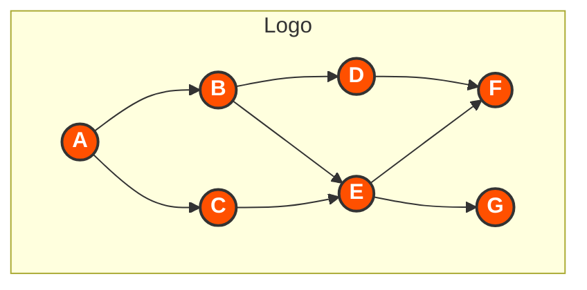
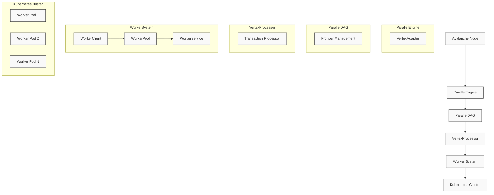
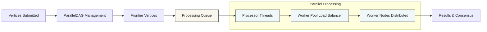
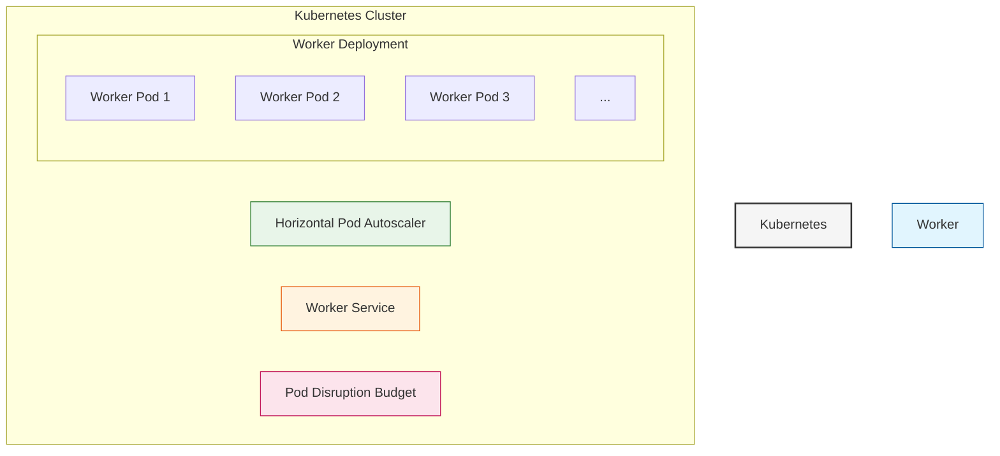

# Avalanche Parallel DAG Implementation

<div align="center">



*A high-performance, scalable implementation of Directed Acyclic Graph (DAG) processing for the Avalanche consensus protocol*

</div>

## 📋 Overview

This project implements an optimized version of the Directed Acyclic Graph (DAG) for the Avalanche consensus protocol using parallel processing techniques. It significantly improves transaction throughput and reduces confirmation latency by leveraging:

- Multi-threaded processing within a single node
- Distributed processing across multiple Kubernetes worker pods
- Efficient frontier management for optimal parallel execution

## ✨ Features

<table>
  <tr>
    <td align="center"><b>⚡ Parallel Processing</b></td>
    <td>Process multiple vertices simultaneously to improve throughput</td>
  </tr>
  <tr>
    <td align="center"><b>🌐 Distributed Workers</b></td>
    <td>Scale processing across multiple pods for unlimited capacity</td>
  </tr>
  <tr>
    <td align="center"><b>♾️ Auto-Scaling</b></td>
    <td>Automatically adapt to workload with Kubernetes HPA</td>
  </tr>
  <tr>
    <td align="center"><b>🛡️ Fault Tolerance</b></td>
    <td>Continue operation even when individual worker pods fail</td>
  </tr>
  <tr>
    <td align="center"><b>📊 Performance Monitoring</b></td>
    <td>Built-in metrics and benchmarking capabilities</td>
  </tr>
</table>

## 🏗️ System Architecture

The system is designed as a layered architecture with specialized components optimized for parallel processing:



### Core Components in Detail

#### 🔄 ParallelEngine

The ParallelEngine serves as the primary interface between the existing Avalanche consensus engine and our parallelized processing infrastructure.

**Key Responsibilities:**
- Adapts traditional Avalanche vertices to our enhanced ParallelVertex format
- Coordinates the entire parallel processing lifecycle
- Provides a seamless integration point with the existing Avalanche codebase

**Implementation Highlights:**
```go
// ParallelEngine extends the avalanche engine with parallel processing capabilities
type ParallelEngine struct {
    logger      logging.Logger
    parallelDAG *ParallelDAG
    baseEngine  interface{} 
}
```

#### 📊 ParallelDAG

The ParallelDAG component is the heart of our optimization, maintaining an efficient DAG structure specifically designed for parallel operations.

**Key Responsibilities:**
- Maintains the structure of the directed acyclic graph
- Tracks the "frontier" (vertices with no accepted descendants)
- Efficiently determines which vertices can be processed in parallel
- Handles concurrent access with fine-grained locking

**Implementation Highlights:**
```go
// ParallelDAG optimizes the DAG processing using parallel execution
type ParallelDAG struct {
    lock         sync.RWMutex
    logger       logging.Logger
    vertices     map[ids.ID]ParallelVertex
    edgeVertices map[ids.ID]struct{}
    frontier     map[ids.ID]ParallelVertex
    maxWorkers   int
    processor    VertexProcessor
}
```

#### ⚙️ VertexProcessor

The VertexProcessor handles the actual processing of vertices, distributing the workload across multiple threads.

**Key Responsibilities:**
- Parallelizes the processing of multiple vertices
- Manages a thread pool for efficient CPU utilization
- Executes transaction verification in parallel
- Coordinates result collection and error handling

**Implementation Highlights:**
```go
// DefaultVertexProcessor is a basic processor that processes vertices in parallel
type DefaultVertexProcessor struct {
    logger     logging.Logger
    maxWorkers int
}

// ProcessVertices processes multiple vertices in parallel
func (p *DefaultVertexProcessor) ProcessVertices(ctx context.Context, vertices []ParallelVertex) error {
    // Implementation uses worker threads and semaphores for parallel processing
}
```

#### 🌐 Worker System

The Worker System distributes processing across multiple nodes to achieve horizontal scalability.

**Components:**
- **WorkerClient**: Submits tasks to remote worker services
- **WorkerPool**: Manages a pool of worker instances for load balancing
- **WorkerService**: HTTP service that runs in Kubernetes worker pods

**Implementation Highlights:**
```go
// WorkerPool manages a pool of workers
type WorkerPool struct {
    lock     sync.RWMutex
    workers  map[string]Worker
    taskChan chan Task
    results  map[string]Result
    logger   logging.Logger
}
```

#### 🚀 Kubernetes Integration

Our system leverages Kubernetes for deployment, scaling, and management of worker pods.

**Key Features:**
- Horizontal Pod Autoscaler for dynamic scaling
- Pod Disruption Budget for high availability
- Health and readiness probes for reliability
- Resource limits and requests for optimal resource utilization

## 🔄 Data Flow Diagram

This enhanced diagram illustrates how data flows through the system, from vertex submission to result collection:



## 🔄 Processing Flow

The system follows a sophisticated processing flow that maximizes parallel execution while maintaining consensus correctness:

<div align="center">
<table>
  <tr>
    <th>Stage</th>
    <th>Description</th>
  </tr>
  <tr>
    <td><b>1. Vertex Submission</b></td>
    <td>Vertices are submitted to the ParallelEngine from the Avalanche consensus layer</td>
  </tr>
  <tr>
    <td><b>2. Vertex Adaptation</b></td>
    <td>Standard Avalanche vertices are converted to ParallelVertex format with additional metadata</td>
  </tr>
  <tr>
    <td><b>3. DAG Management</b></td>
    <td>ParallelDAG component adds vertices and updates the frontier using a thread-safe approach</td>
  </tr>
  <tr>
    <td><b>4. Frontier Analysis</b></td>
    <td>The system identifies which frontier vertices can be processed in parallel</td>
  </tr>
  <tr>
    <td><b>5. Task Distribution</b></td>
    <td>Processing tasks are distributed to local worker threads or remote worker services</td>
  </tr>
  <tr>
    <td><b>6. Parallel Execution</b></td>
    <td>Tasks are executed concurrently across multiple threads and/or nodes</td>
  </tr>
  <tr>
    <td><b>7. Result Collection</b></td>
    <td>Processing results are gathered, with error handling for failed tasks</td>
  </tr>
  <tr>
    <td><b>8. State Update</b></td>
    <td>The DAG state is updated based on processing results, and the frontier is recalculated</td>
  </tr>
</table>
</div>

## 🌐 Kubernetes Deployment Architecture

Our system leverages Kubernetes for robust, scalable deployment:



Each worker pod is configured with:

- **Resource Management**: Precise CPU and memory limits to ensure optimal performance
- **Health Monitoring**: Sophisticated probes to detect and recover from failures
- **Configuration**: Environment variables for flexible deployment options
- **Networking**: Service discovery for seamless communication

## 💻 API Reference

### ParallelVertex Interface

```go
// ParallelVertex extends the functionality of the base Vertex
type ParallelVertex interface {
    avalanche.Vertex
    ID() ids.ID
    GetProcessingPriority() uint64
}
```

### Worker Service API

<div align="center">
<table>
  <tr>
    <th>Endpoint</th>
    <th>Method</th>
    <th>Description</th>
    <th>Request/Response</th>
  </tr>
  <tr>
    <td><code>/tasks</code></td>
    <td>POST</td>
    <td>Submit a new processing task</td>
    <td>
      <b>Request:</b> <code>{ "payload": Base64EncodedBytes }</code><br>
      <b>Response:</b> <code>{ "task_id": "uuid", "status": "accepted" }</code>
    </td>
  </tr>
  <tr>
    <td><code>/tasks/{id}</code></td>
    <td>GET</td>
    <td>Retrieve task result</td>
    <td>
      <b>Response:</b> <code>{ "task_id": "uuid", "output": Base64EncodedBytes, "error": null, "start_time": "timestamp", "end_time": "timestamp" }</code>
    </td>
  </tr>
  <tr>
    <td><code>/health</code></td>
    <td>GET</td>
    <td>Service health check</td>
    <td>
      <b>Response:</b> <code>{ "status": "healthy" }</code>
    </td>
  </tr>
  <tr>
    <td><code>/readiness</code></td>
    <td>GET</td>
    <td>Service readiness check</td>
    <td>
      <b>Response:</b> <code>{ "status": "ready" }</code>
    </td>
  </tr>
</table>
</div>

## 📊 Performance Characteristics

Our parallel DAG implementation delivers significant performance improvements over the sequential implementation:

<div align="center">
<table>
  <tr>
    <th>Metric</th>
    <th>Improvement</th>
    <th>Details</th>
  </tr>
  <tr>
    <td><b>Throughput</b></td>
    <td>Up to 4x with 4 threads</td>
    <td>Near-linear scaling with thread count</td>
  </tr>
  <tr>
    <td><b>Scaling</b></td>
    <td>Linear with worker pods</td>
    <td>Horizontal scaling up to cluster capacity</td>
  </tr>
  <tr>
    <td><b>Latency</b></td>
    <td>Significantly reduced</td>
    <td>Faster transaction confirmation times</td>
  </tr>
  <tr>
    <td><b>Resilience</b></td>
    <td>High</td>
    <td>Continues operation during partial outages</td>
  </tr>
</table>
</div>

## 🔍 Benchmark

Evaluate the DAG processing performance using our benchmark tool:

```bash
# Run the benchmark with 1000 vertices and 4 threads
go run ./cmd/benchmark -vertices=1000 -threads=4 -iterations=10
```

Sample benchmark results:

```
2024/05/27 17:10:23 INFO [benchmark] Creating DAG with 1000 vertices
2024/05/27 17:10:24 INFO [benchmark] Running sequential processing benchmark
2024/05/27 17:10:35 INFO [benchmark] Sequential processing took 11.25s
2024/05/27 17:10:35 INFO [benchmark] Running parallel processing benchmark with 4 threads
2024/05/27 17:10:38 INFO [benchmark] Parallel processing took 3.02s
2024/05/27 17:10:38 INFO [benchmark] Speedup: 3.73x
2024/05/27 17:10:38 INFO [benchmark] Efficiency: 93.25%
```

## 📝 Usage Example

Integrate the parallel DAG implementation into your Avalanche node:

```go
import (
    "context"
    "github.com/avalanche-parallel-dag/pkg/consensus"
    "github.com/Final-Project-13520137/avalanche-parallel/default/utils/logging"
)

func main() {
    // Initialize logger
    logFactory := logging.NewFactory(logging.Config{
        DisplayLevel: "info",
    })
    logger, _ := logFactory.Make("parallel-dag")
    
    // Create parallel engine with 4 worker threads
    parallelEngine := consensus.NewParallelEngine(logger, 4)
    
    // Process a vertex
    ctx := context.Background()
    err := parallelEngine.ProcessVertex(ctx, vertex)
    if err != nil {
        logger.Error("Failed to process vertex: %s", err)
    }
    
    // Or process multiple vertices in batch
    err = parallelEngine.BatchProcessVertices(ctx, vertices)
    if err != nil {
        logger.Error("Failed to process vertices: %s", err)
    }
}
```

## ⚙️ Configuration Options

Worker nodes can be configured using environment variables:

<div align="center">
<table>
  <tr>
    <th>Variable</th>
    <th>Default</th>
    <th>Description</th>
  </tr>
  <tr>
    <td><code>PORT</code></td>
    <td>9650</td>
    <td>HTTP port for worker API</td>
  </tr>
  <tr>
    <td><code>LOG_LEVEL</code></td>
    <td>info</td>
    <td>Logging level (debug, info, warn, error, fatal)</td>
  </tr>
  <tr>
    <td><code>MAX_PROCESSING_THREADS</code></td>
    <td>4</td>
    <td>Number of processing threads per worker</td>
  </tr>
  <tr>
    <td><code>MAX_WORKERS</code></td>
    <td>4</td>
    <td>Maximum number of worker instances</td>
  </tr>
</table>
</div>

## 🔄 Dependencies

This project depends on the Avalanche codebase. By default, the project looks for the Avalanche code in the `./default` directory within this repository.

The go.mod file includes a replace directive to handle this dependency:

```
replace github.com/Final-Project-13520137/avalanche-parallel => ./default
```

### Alternative Path Configuration

If your Avalanche code is located elsewhere, you have several options:

1. **Update the replace directive in go.mod:**
   ```
   replace github.com/Final-Project-13520137/avalanche-parallel => /path/to/avalanche-parallel
   ```

2. **Use an environment variable:**
   ```bash
   # For Linux/macOS
   export AVALANCHE_PARALLEL_PATH=/path/to/avalanche-parallel
   go mod edit -replace github.com/Final-Project-13520137/avalanche-parallel=$AVALANCHE_PARALLEL_PATH
   
   # For Windows PowerShell
   $env:AVALANCHE_PARALLEL_PATH="C:\path\to\avalanche-parallel"
   go mod edit -replace github.com/Final-Project-13520137/avalanche-parallel=$env:AVALANCHE_PARALLEL_PATH
   ```

### Troubleshooting Module Issues

If you encounter errors like:

```
replacement directory does not exist
```

This indicates that Go cannot find the Avalanche code at the path specified in the replace directive.

#### Using Helper Scripts

We provide helper scripts to fix module path issues easily:

1. **For Windows:**
   ```powershell
   .\fix-module-path.ps1
   ```

2. **For Linux/macOS/WSL:**
   ```bash
   chmod +x fix-module-path.sh
   ./fix-module-path.sh
   ```

These scripts will guide you through setting up the correct path to the Avalanche code, either by updating the go.mod file or creating symbolic links.

#### For WSL/Docker Users

When running in WSL or Docker, make sure the path in the replace directive is accessible in your environment:

```bash
# Check if the path exists
ls -la ./default

# If it doesn't exist, create a symbolic link
ln -s /path/to/avalanche/code ./default

# Or update go.mod to point to the correct path
go mod edit -replace github.com/Final-Project-13520137/avalanche-parallel=/path/to/avalanche/code
```

#### Using the Included Code Copy

This repository includes a copy of the necessary Avalanche code in the `default` directory. In most cases, this should be sufficient for running tests and examples without additional configuration.

#### Go Version Compatibility

If you encounter an error like:

```
go: go.mod file indicates go 1.21, but maximum version supported by tidy is 1.18
```

This means the Go version specified in your go.mod file is higher than the version available in your environment. You can fix this by:

1. **Using the simple version fix script (recommended for WSL/Docker):**
   
   ```bash
   # Make the script executable
   chmod +x fix-go-version.sh
   
   # Run the script
   ./fix-go-version.sh
   ```

2. **Using the helper scripts:**
   
   Our helper scripts automatically detect version mismatches and fix them:
   
   ```bash
   # Linux/macOS/WSL
   ./fix-module-path.sh
   
   # Windows
   .\fix-module-path.ps1
   ```

3. **Manually editing go.mod:**
   
   Change the Go version in go.mod to match your environment:
   
   ```bash
   # Check your Go version
   go version
   
   # Edit go.mod to match
   # For example, change "go 1.21" to "go 1.18" if that's your version
   sed -i 's/go 1.21/go 1.18/' go.mod   # Linux/macOS
   (Get-Content go.mod) -replace 'go 1.21', 'go 1.18' | Set-Content go.mod  # Windows PowerShell
   ```

4. **Using the go mod edit command:**
   
   ```bash
   # Set Go version to 1.18
   go mod edit -go=1.18
   ```

After changing the Go version, run `go mod tidy` again to update dependencies.

#### Module Path Mismatch

If you encounter an error like:

```
module declares its path as: github.com/ava-labs/avalanchego
but was required as: github.com/Final-Project-13520137/avalanche-parallel/default
```

This is a module path mismatch issue. The Avalanche code in the `default` directory declares itself as `github.com/ava-labs/avalanchego`, but our code is trying to import it as `github.com/Final-Project-13520137/avalanche-parallel/default`.

To fix this issue:

1. **Using the import path fix script:**
   
   ```bash
   # Linux/macOS/WSL
   chmod +x fix-imports.sh
   ./fix-imports.sh
   
   # Windows
   .\fix-imports.ps1
   ```

   These scripts will:
   - Update all import paths in your code
   - Modify the `go.mod` file to use the correct replacement
   - Run `go mod tidy` to update dependencies

2. **Manually updating import paths:**
   
   If you prefer to fix the issue manually:
   
   - Edit your Go files to change import paths from:
     ```go
     import "github.com/Final-Project-13520137/avalanche-parallel/default/..."
     ```
     to:
     ```go
     import "github.com/ava-labs/avalanchego/..."
     ```
     
   - Update your `go.mod` file to change:
     ```
     replace github.com/Final-Project-13520137/avalanche-parallel => ./default
     ```
     to:
     ```
     replace github.com/ava-labs/avalanchego => ./default
     ```

After making these changes, run `go mod tidy` to update dependencies.

## 🧪 Running Tests

This repository includes comprehensive tests for the Avalanche Parallel Blockchain implementation, covering various aspects of blockchain functionality with a focus on transaction handling and parallel processing.

### Using Test Scripts

The simplest way to run tests is using the provided scripts:

1. **For Windows:**
   ```powershell
   .\runtest.ps1
   ```

2. **For Linux/macOS:**
   ```bash
   ./restart.sh
   ```

### Running Tests Manually

You can also run specific tests manually:

```bash
# Run all tests
go test -v github.com/Final-Project-13520137/avalanche-parallel-dag/pkg/blockchain

# Run specific test category
go test -v github.com/Final-Project-13520137/avalanche-parallel-dag/pkg/blockchain -run TestTransaction
go test -v github.com/Final-Project-13520137/avalanche-parallel-dag/pkg/blockchain -run TestBlock
go test -v github.com/Final-Project-13520137/avalanche-parallel-dag/pkg/blockchain -run TestBlockchain
go test -v github.com/Final-Project-13520137/avalanche-parallel-dag/pkg/blockchain -run TestFull
```

### Running Simple Test Example

To run the simplified blockchain test example:

```bash
# Build the test
go build -o test_blockchain.exe simple_test.go

# Run the test
./test_blockchain.exe
```

### Test Categories

The test suite includes various test categories:

1. **Unit Tests** - Cover individual components:
   - Transaction creation, validation and signing
   - Block creation, validation and status transitions
   - Blockchain initialization and transaction handling

2. **Integration Tests** - Test the complete blockchain flow:
   - Full transaction lifecycle
   - Fork resolution
   - Double spend handling
   - High load testing
   - Parallel consensus benchmarking

3. **Load Testing** - Simulates various transaction patterns:
   - Normal transactions
   - Double spend attempts
   - High value transactions
   - Micro transactions
   - Transaction bursts

### Test Output

The tests produce detailed output about transaction processing, block creation, and consensus outcomes. Watch for:

- Block acceptance/rejection
- Transaction status changes
- Fork resolution
- Performance metrics for parallel processing

### Request ID Verification

When working with specific request IDs, you can verify if they're being processed correctly using the following approaches:

1. **Check Process Status:**
   
   To verify if a request is being processed (e.g., request ID "64d0f14f-e0b8-4a77-b2f3-c769789177b1"):
   
   ```powershell
   # Windows PowerShell
   .\runtest.ps1
   
   # Linux/macOS/WSL
   ./restart.sh
   
   # Alternatively, run the test directly with specific outputs
   go build -o test_blockchain test_blockchain.go
   ./test_blockchain -request-id=64d0f14f-e0b8-4a77-b2f3-c769789177b1 -verbose
   ```

2. **Check Logs:**

   Examine the generated logs for the specific request ID:
   
   ```bash
   # Windows PowerShell
   Select-String -Path .\logs\* -Pattern "64d0f14f-e0b8-4a77-b2f3-c769789177b1"
   
   # Linux/macOS/WSL
   grep -r "64d0f14f-e0b8-4a77-b2f3-c769789177b1" ./logs/
   ```

3. **Request Status API:**

   If running with the API enabled, you can check the status via HTTP:
   
   ```bash
   # Using curl
   curl -X GET "http://localhost:9650/ext/blockchain/request-status?id=64d0f14f-e0b8-4a77-b2f3-c769789177b1"
   ```

4. **For WSL/Docker Users:**

   When running in a containerized environment, ensure your environment has the proper path configuration:
   
   ```bash
   # Set the correct path to the Avalanche code
   export AVALANCHE_PARALLEL_PATH=/mnt/wsl/docker-desktop-bind-mounts/Ubuntu-22.04/path/to/avalanche-code
   
   # Update go.mod
   go mod edit -replace github.com/Final-Project-13520137/avalanche-parallel=$AVALANCHE_PARALLEL_PATH
   
   # Run the test
   go test -v github.com/Final-Project-13520137/avalanche-parallel-dag/pkg/blockchain
   
   # For a specific request ID
   go test -v github.com/Final-Project-13520137/avalanche-parallel-dag/pkg/blockchain -run TestRequestID -request-id=64d0f14f-e0b8-4a77-b2f3-c769789177b1
   ```

Request IDs in the system are tracked through the processing pipeline, and their status is recorded in the logs. A successful request processing will show confirmation in the output.

## 📄 License

See the [LICENSE](LICENSE) file for details.

## 🐳 Running with Docker Compose

We provide a complete Docker Compose setup to easily run the entire Avalanche Parallel DAG system, including:

- Avalanche node with parallel DAG implementation
- Multiple worker nodes for distributed processing
- Prometheus for metrics collection
- Grafana for visualization and monitoring

### Prerequisites

- Docker and Docker Compose installed on your system
- At least 4GB of RAM available for the containers

### Starting the System

```bash
# Clone the repository (if you haven't already)
git clone https://github.com/your-username/avalanche-parallel-dag.git
cd avalanche-parallel-dag

# Start all services
docker-compose up -d

# Check service status
docker-compose ps
```

### Troubleshooting Docker Compose

If Docker Compose doesn't find the configuration file automatically, you can explicitly specify the path:

```bash
# Using the full path to docker-compose.yml
docker-compose -f /path/to/docker-compose.yml up -d

# For Windows PowerShell
docker-compose -f $PWD\docker-compose.yml up -d

# For Linux/macOS
docker-compose -f $(pwd)/docker-compose.yml up -d
```

Make sure your avalanche-parallel repository is available in the parent directory, as the Docker setup mounts it as a volume.

#### Windows: Verify your directory structure
dir ..

# Linux/macOS: Verify your directory structure
ls -la ..
```

You should see `avalanche-parallel` in the parent directory.

#### Setting the Path to Avalanche Parallel Repository

If your avalanche-parallel repository is not in the default location (parent directory), you can specify its path using an environment variable:

```bash
# Windows
set AVALANCHE_PARALLEL_PATH=C:\path\to\avalanche-parallel
docker-compose up -d

# Linux/macOS
export AVALANCHE_PARALLEL_PATH=/path/to/avalanche-parallel
docker-compose up -d
```

#### Troubleshooting Symlink Errors

If you encounter symlink errors like:

```
ERROR [avalanche-node builder] RUN ln -s /avalanche-parallel /go/src/github.com/Final-Project-13520137/avalanche-parallel:
ln: /go/src/github.com/Final-Project-13520137/avalanche-parallel: No such file or directory
```

You can try to build the containers with the `--build-arg` flag:

```bash
docker-compose build --build-arg AVALANCHE_PARALLEL_PATH=../avalanche-parallel
```

### Accessing Services

Once running, you can access the following services:

- **Avalanche Node API**: http://localhost:9650/ext/info
- **Prometheus**: http://localhost:9090
- **Grafana**: http://localhost:3000 (username: admin, password: admin)

### Scaling Workers

You can easily scale the number of worker nodes:

```bash
# Scale to 5 worker nodes
docker-compose up -d --scale worker=5
```

### Monitoring

The Grafana dashboard provides insights into:

- Vertex processing rate
- Worker node activity
- DAG frontier size
- Processing time statistics

### Stopping the System

```bash
# Stop all services
docker-compose down

# Stop and remove volumes (clears all data)
docker-compose down -v
```

---

## Module Path and Import Fixes

If you encounter module path or import path errors, we've provided scripts to help fix them. Common issues include:

1. **Module path mismatch**: If you see errors like "module declares its path as: github.com/ava-labs/avalanchego but was required as: github.com/Final-Project-13520137/avalanche-parallel/default", you need to fix the import paths in your code.

2. **Import path errors**: If your code tries to import from "github.com/Final-Project-13520137/avalanche-parallel/default" but the code actually declares "github.com/ava-labs/avalanchego", you'll need to update the imports.

### Fixing with Provided Scripts

Run one of these scripts to automatically fix common import path issues:

#### Windows (PowerShell):
```powershell
# Fix all import paths in the project
.\fix-all-imports.ps1
```

#### Linux/macOS:
```bash
# Fix all import paths in the project
./fix-all-imports.sh
```

### Manual Fixes

If you prefer to fix imports manually, follow these steps:

1. Update the go.mod replace directive:
   ```
   replace github.com/ava-labs/avalanchego => ./default
   ```

2. In your code, use imports that point to the actual module path:
   ```go
   import (
       "github.com/ava-labs/avalanchego/ids"
       "github.com/ava-labs/avalanchego/utils/logging"
   )
   ```

3. Run `go mod tidy` after making changes.

This will ensure that your code correctly references the Avalanche modules regardless of where they're physically located in your project.