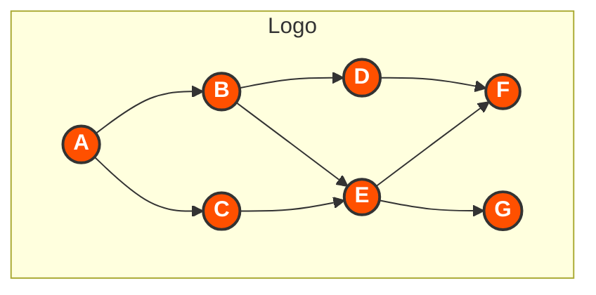
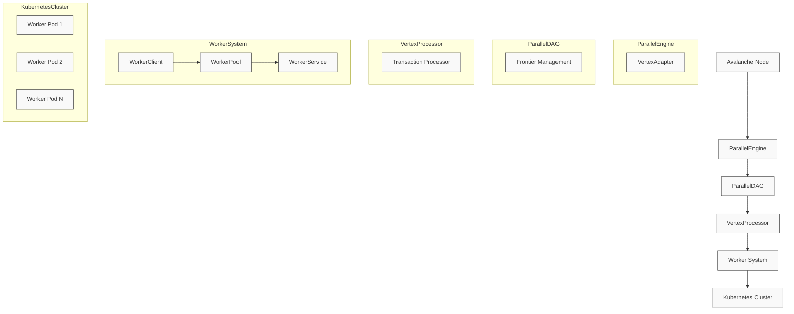
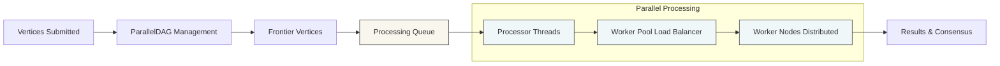
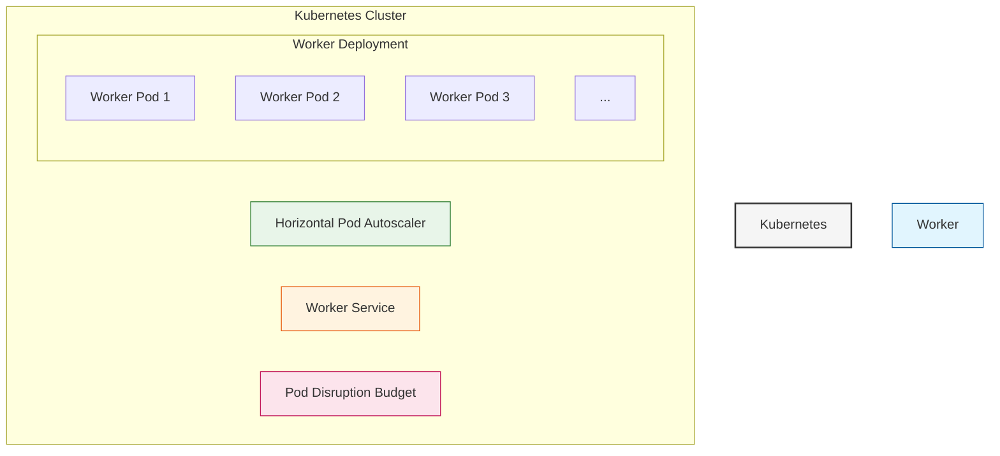

# Avalanche Parallel DAG Implementation

<div align="center">



*A high-performance, scalable implementation of Directed Acyclic Graph (DAG) processing for the Avalanche consensus protocol*

</div>

## 📋 Overview

This project implements an optimized version of the Directed Acyclic Graph (DAG) for the Avalanche consensus protocol using parallel processing techniques. It significantly improves transaction throughput and reduces confirmation latency by leveraging:

- Multi-threaded processing within a single node
- Distributed processing across multiple Kubernetes worker pods
- Efficient frontier management for optimal parallel execution

## ✨ Features

<table>
  <tr>
    <td align="center"><b>⚡ Parallel Processing</b></td>
    <td>Process multiple vertices simultaneously to improve throughput</td>
  </tr>
  <tr>
    <td align="center"><b>🌐 Distributed Workers</b></td>
    <td>Scale processing across multiple pods for unlimited capacity</td>
  </tr>
  <tr>
    <td align="center"><b>♾️ Auto-Scaling</b></td>
    <td>Automatically adapt to workload with Kubernetes HPA</td>
  </tr>
  <tr>
    <td align="center"><b>🛡️ Fault Tolerance</b></td>
    <td>Continue operation even when individual worker pods fail</td>
  </tr>
  <tr>
    <td align="center"><b>📊 Performance Monitoring</b></td>
    <td>Built-in metrics and benchmarking capabilities</td>
  </tr>
</table>

## 🏗️ System Architecture

The system is designed as a layered architecture with specialized components optimized for parallel processing:



### Core Components in Detail

#### 🔄 ParallelEngine

The ParallelEngine serves as the primary interface between the existing Avalanche consensus engine and our parallelized processing infrastructure.

**Key Responsibilities:**
- Adapts traditional Avalanche vertices to our enhanced ParallelVertex format
- Coordinates the entire parallel processing lifecycle
- Provides a seamless integration point with the existing Avalanche codebase

**Implementation Highlights:**
```go
// ParallelEngine extends the avalanche engine with parallel processing capabilities
type ParallelEngine struct {
    logger      logging.Logger
    parallelDAG *ParallelDAG
    baseEngine  interface{} 
}
```

#### 📊 ParallelDAG

The ParallelDAG component is the heart of our optimization, maintaining an efficient DAG structure specifically designed for parallel operations.

**Key Responsibilities:**
- Maintains the structure of the directed acyclic graph
- Tracks the "frontier" (vertices with no accepted descendants)
- Efficiently determines which vertices can be processed in parallel
- Handles concurrent access with fine-grained locking

**Implementation Highlights:**
```go
// ParallelDAG optimizes the DAG processing using parallel execution
type ParallelDAG struct {
    lock         sync.RWMutex
    logger       logging.Logger
    vertices     map[ids.ID]ParallelVertex
    edgeVertices map[ids.ID]struct{}
    frontier     map[ids.ID]ParallelVertex
    maxWorkers   int
    processor    VertexProcessor
}
```

#### ⚙️ VertexProcessor

The VertexProcessor handles the actual processing of vertices, distributing the workload across multiple threads.

**Key Responsibilities:**
- Parallelizes the processing of multiple vertices
- Manages a thread pool for efficient CPU utilization
- Executes transaction verification in parallel
- Coordinates result collection and error handling

**Implementation Highlights:**
```go
// DefaultVertexProcessor is a basic processor that processes vertices in parallel
type DefaultVertexProcessor struct {
    logger     logging.Logger
    maxWorkers int
}

// ProcessVertices processes multiple vertices in parallel
func (p *DefaultVertexProcessor) ProcessVertices(ctx context.Context, vertices []ParallelVertex) error {
    // Implementation uses worker threads and semaphores for parallel processing
}
```

#### 🌐 Worker System

The Worker System distributes processing across multiple nodes to achieve horizontal scalability.

**Components:**
- **WorkerClient**: Submits tasks to remote worker services
- **WorkerPool**: Manages a pool of worker instances for load balancing
- **WorkerService**: HTTP service that runs in Kubernetes worker pods

**Implementation Highlights:**
```go
// WorkerPool manages a pool of workers
type WorkerPool struct {
    lock     sync.RWMutex
    workers  map[string]Worker
    taskChan chan Task
    results  map[string]Result
    logger   logging.Logger
}
```

#### 🚀 Kubernetes Integration

Our system leverages Kubernetes for deployment, scaling, and management of worker pods.

**Key Features:**
- Horizontal Pod Autoscaler for dynamic scaling
- Pod Disruption Budget for high availability
- Health and readiness probes for reliability
- Resource limits and requests for optimal resource utilization

## 🔄 Data Flow Diagram

This enhanced diagram illustrates how data flows through the system, from vertex submission to result collection:



## 🔄 Processing Flow

The system follows a sophisticated processing flow that maximizes parallel execution while maintaining consensus correctness:

<div align="center">
<table>
  <tr>
    <th>Stage</th>
    <th>Description</th>
  </tr>
  <tr>
    <td><b>1. Vertex Submission</b></td>
    <td>Vertices are submitted to the ParallelEngine from the Avalanche consensus layer</td>
  </tr>
  <tr>
    <td><b>2. Vertex Adaptation</b></td>
    <td>Standard Avalanche vertices are converted to ParallelVertex format with additional metadata</td>
  </tr>
  <tr>
    <td><b>3. DAG Management</b></td>
    <td>ParallelDAG component adds vertices and updates the frontier using a thread-safe approach</td>
  </tr>
  <tr>
    <td><b>4. Frontier Analysis</b></td>
    <td>The system identifies which frontier vertices can be processed in parallel</td>
  </tr>
  <tr>
    <td><b>5. Task Distribution</b></td>
    <td>Processing tasks are distributed to local worker threads or remote worker services</td>
  </tr>
  <tr>
    <td><b>6. Parallel Execution</b></td>
    <td>Tasks are executed concurrently across multiple threads and/or nodes</td>
  </tr>
  <tr>
    <td><b>7. Result Collection</b></td>
    <td>Processing results are gathered, with error handling for failed tasks</td>
  </tr>
  <tr>
    <td><b>8. State Update</b></td>
    <td>The DAG state is updated based on processing results, and the frontier is recalculated</td>
  </tr>
</table>
</div>

## 🌐 Kubernetes Deployment Architecture

Our system leverages Kubernetes for robust, scalable deployment:



Each worker pod is configured with:

- **Resource Management**: Precise CPU and memory limits to ensure optimal performance
- **Health Monitoring**: Sophisticated probes to detect and recover from failures
- **Configuration**: Environment variables for flexible deployment options
- **Networking**: Service discovery for seamless communication

## 💻 API Reference

### ParallelVertex Interface

```go
// ParallelVertex extends the functionality of the base Vertex
type ParallelVertex interface {
    avalanche.Vertex
    ID() ids.ID
    GetProcessingPriority() uint64
}
```

### Worker Service API

<div align="center">
<table>
  <tr>
    <th>Endpoint</th>
    <th>Method</th>
    <th>Description</th>
    <th>Request/Response</th>
  </tr>
  <tr>
    <td><code>/tasks</code></td>
    <td>POST</td>
    <td>Submit a new processing task</td>
    <td>
      <b>Request:</b> <code>{ "payload": Base64EncodedBytes }</code><br>
      <b>Response:</b> <code>{ "task_id": "uuid", "status": "accepted" }</code>
    </td>
  </tr>
  <tr>
    <td><code>/tasks/{id}</code></td>
    <td>GET</td>
    <td>Retrieve task result</td>
    <td>
      <b>Response:</b> <code>{ "task_id": "uuid", "output": Base64EncodedBytes, "error": null, "start_time": "timestamp", "end_time": "timestamp" }</code>
    </td>
  </tr>
  <tr>
    <td><code>/health</code></td>
    <td>GET</td>
    <td>Service health check</td>
    <td>
      <b>Response:</b> <code>{ "status": "healthy" }</code>
    </td>
  </tr>
  <tr>
    <td><code>/readiness</code></td>
    <td>GET</td>
    <td>Service readiness check</td>
    <td>
      <b>Response:</b> <code>{ "status": "ready" }</code>
    </td>
  </tr>
</table>
</div>

## 📊 Performance Characteristics

Our parallel DAG implementation delivers significant performance improvements over the sequential implementation:

<div align="center">
<table>
  <tr>
    <th>Metric</th>
    <th>Improvement</th>
    <th>Details</th>
  </tr>
  <tr>
    <td><b>Throughput</b></td>
    <td>Up to 4x with 4 threads</td>
    <td>Near-linear scaling with thread count</td>
  </tr>
  <tr>
    <td><b>Scaling</b></td>
    <td>Linear with worker pods</td>
    <td>Horizontal scaling up to cluster capacity</td>
  </tr>
  <tr>
    <td><b>Latency</b></td>
    <td>Significantly reduced</td>
    <td>Faster transaction confirmation times</td>
  </tr>
  <tr>
    <td><b>Resilience</b></td>
    <td>High</td>
    <td>Continues operation during partial outages</td>
  </tr>
</table>
</div>

## 🔍 Benchmark

Evaluate the DAG processing performance using our benchmark tool:

```bash
# Run the benchmark with 1000 vertices and 4 threads
go run ./cmd/benchmark -vertices=1000 -threads=4 -iterations=10
```

Sample benchmark results:

```
2024/05/27 17:10:23 INFO [benchmark] Creating DAG with 1000 vertices
2024/05/27 17:10:24 INFO [benchmark] Running sequential processing benchmark
2024/05/27 17:10:35 INFO [benchmark] Sequential processing took 11.25s
2024/05/27 17:10:35 INFO [benchmark] Running parallel processing benchmark with 4 threads
2024/05/27 17:10:38 INFO [benchmark] Parallel processing took 3.02s
2024/05/27 17:10:38 INFO [benchmark] Speedup: 3.73x
2024/05/27 17:10:38 INFO [benchmark] Efficiency: 93.25%
```

## 📝 Usage Example

Integrate the parallel DAG implementation into your Avalanche node:

```go
import (
    "context"
    "github.com/avalanche-parallel-dag/pkg/consensus"
    "github.com/Final-Project-13520137/avalanche-parallel/default/utils/logging"
)

func main() {
    // Initialize logger
    logFactory := logging.NewFactory(logging.Config{
        DisplayLevel: "info",
    })
    logger, _ := logFactory.Make("parallel-dag")
    
    // Create parallel engine with 4 worker threads
    parallelEngine := consensus.NewParallelEngine(logger, 4)
    
    // Process a vertex
    ctx := context.Background()
    err := parallelEngine.ProcessVertex(ctx, vertex)
    if err != nil {
        logger.Error("Failed to process vertex: %s", err)
    }
    
    // Or process multiple vertices in batch
    err = parallelEngine.BatchProcessVertices(ctx, vertices)
    if err != nil {
        logger.Error("Failed to process vertices: %s", err)
    }
}
```

## ⚙️ Configuration Options

Worker nodes can be configured using environment variables:

<div align="center">
<table>
  <tr>
    <th>Variable</th>
    <th>Default</th>
    <th>Description</th>
  </tr>
  <tr>
    <td><code>PORT</code></td>
    <td>9650</td>
    <td>HTTP port for worker API</td>
  </tr>
  <tr>
    <td><code>LOG_LEVEL</code></td>
    <td>info</td>
    <td>Logging level (debug, info, warn, error, fatal)</td>
  </tr>
  <tr>
    <td><code>MAX_PROCESSING_THREADS</code></td>
    <td>4</td>
    <td>Number of processing threads per worker</td>
  </tr>
  <tr>
    <td><code>MAX_WORKERS</code></td>
    <td>4</td>
    <td>Maximum number of worker instances</td>
  </tr>
</table>
</div>

## 🔄 Dependencies

This project depends on the local avalanche-parallel codebase. Make sure it's available at the relative path:

```
../avalanche-parallel
```

The go.mod file includes a replace directive to handle this dependency:

```
replace github.com/Final-Project-13520137/avalanche-parallel => ../avalanche-parallel
```

## 📄 License

See the [LICENSE](LICENSE) file for details.

---