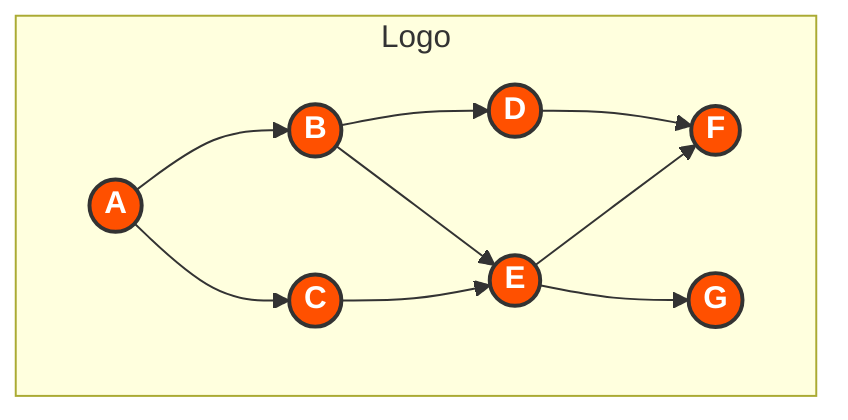

# Avalanche Parallel DAG

## Project Structure

The project has been reorganized into a more modular structure:

```
avalanche-parallel/
├── bin/                # Executable binaries
├── cmd/                # Command line applications
│   ├── avalanche/      # Main Avalanche node implementation
│   ├── benchmark/      # Benchmarking tools
│   ├── blockchain/     # Blockchain CLI tools
│   └── worker/         # Worker node implementation
├── config/             # Configuration files
│   ├── docker-compose.yml
│   └── temp-docker-compose.yml
├── default/            # Avalanche core fork (from avalanchego)
├── deployments/        # Deployment configurations
│   ├── docker/         # Docker deployment files
│   ├── grafana/        # Grafana dashboards and configurations
│   ├── kubernetes/     # Kubernetes deployment files
│   └── prometheus/     # Prometheus configuration
├── docs/               # Documentation
├── fixer/              # Fix scripts for compatibility issues
│   ├── fix-go-version.ps1  # Fix Go version in go.mod
│   ├── fix-go-compatibility.ps1  # Fix Go compatibility issues
│   └── ...
├── gomod-backups/      # Backup of go.mod files
├── logs/               # Log files
├── pkg/                # Core packages
│   ├── blockchain/     # Blockchain implementation
│   ├── consensus/      # Consensus algorithms
│   ├── scripts/        # Utility scripts
│   ├── test/           # Test utilities
│   ├── utils/          # Utility packages
│   │   ├── compatibility/  # Go compatibility utilities
│   │   ├── logging/        # Logging utilities
│   │   ├── math/           # Math utilities
│   │   ├── sampler/        # Sampling utilities
│   │   └── set/            # Set data structure
│   └── worker/         # Worker node implementation
├── scripts/            # Helper scripts
└── utils/              # Top-level utilities
```

# Avalanche Parallel DAG Implementation

<div align="center">



*A high-performance, scalable implementation of Directed Acyclic Graph (DAG) processing for the Avalanche consensus protocol*

</div>

## 📋 Overview

This project implements an optimized version of the Directed Acyclic Graph (DAG) for the Avalanche consensus protocol using parallel processing techniques. It significantly improves transaction throughput and reduces confirmation latency by leveraging:

- Multi-threaded processing within a single node
- Distributed processing across multiple Kubernetes worker pods
- Efficient frontier management for optimal parallel execution

## ⚠️ Important: Go 1.18 Compatibility

This project **requires Go 1.18 specifically**. It is not compatible with newer Go versions due to dependency constraints.

Common issues and their solutions:

1. **Package Conflict in `utils` Directory**
   - Error: `found packages utils (atomic.go) and main (sorting.go) in default/utils`
   - Solution: Run our fix scripts to correct the package declaration

2. **`bytes.Compare` Syntax Issues**
   - Error: `bytes.Compare undefined (type [][]byte has no field or method Compare)`
   - Solution: Our fix scripts update sorting.go with correct syntax

3. **multierr Dependency Requiring Go 1.19+**
   - Error: `go.uber.org/multierr: undefined: atomic.Bool` and `note: module requires Go 1.19`
   - Solution: Our fix scripts downgrade dependencies to Go 1.18 compatible versions

For detailed troubleshooting, see [fixer/FIX-GO118-GUIDE.md](fixer/FIX-GO118-GUIDE.md).

## 🚀 Installation and Setup Guide

This section provides comprehensive instructions for installing, building, and running the Avalanche Parallel DAG system.

### Prerequisites

- Go 1.18 (specifically requires Go 1.18, not later versions)
- Git
- Docker and Docker Compose (for containerized deployment)
- 4GB+ RAM
- 20GB+ free disk space

### Quick Start Guide

For the fastest setup experience, follow these steps:

```bash
# 1. Clone the repository
git clone https://github.com/Final-Project-13520137/avalanche-parallel-dag.git
cd avalanche-parallel-dag

# 2. Fix Go compatibility (essential for Go 1.18)
# For Windows:
.\fixer\fix-go-version.ps1
.\fixer\fix-go-compatibility.ps1

# For Linux/macOS:
chmod +x fixer/fix-go-version.sh fixer/fix-go-compatibility.sh
./fixer/fix-go-version.sh
./fixer/fix-go-compatibility.sh

# 3. Build the binaries
# For Windows:
go build -o avalanche-parallel.exe .\cmd\avalanche
go build -o worker.exe .\cmd\worker

# For Linux/macOS:
go build -o avalanche-parallel ./cmd/avalanche
go build -o worker ./cmd/worker

# 4. Run the applications
# For Windows:
.\avalanche-parallel.exe --network-id=local --staking-enabled=false --http-port=9650
# In another terminal:
.\worker.exe --api-port=9652 --threads=4

# For Linux/macOS:
./avalanche-parallel --network-id=local --staking-enabled=false --http-port=9650
# In another terminal:
./worker --api-port=9652 --threads=4
```

### Detailed Installation Steps

#### Option 1: Clone Repository

```bash
# Clone the repository
git clone https://github.com/Final-Project-13520137/avalanche-parallel-dag.git
cd avalanche-parallel-dag

# Clone the Avalanche reference code into the default directory (if needed)
git clone https://github.com/ava-labs/avalanchego.git default
```

#### Option 2: Download Release

```bash
# Download the latest release
curl -LO https://github.com/Final-Project-13520137/avalanche-parallel-dag/archive/refs/tags/v1.0.0.tar.gz
tar -xzf v1.0.0.tar.gz
cd avalanche-parallel-dag-1.0.0
```

### Essential: Go Version Compatibility

This project requires Go 1.18 specifically. Follow these steps to ensure compatibility:

#### Step 1: Fix Go Module Version

```bash
# Windows (PowerShell)
.\fixer\fix-go-version.ps1

# Linux/macOS
chmod +x fixer/fix-go-version.sh
./fixer/fix-go-version.sh
```

This will:
- Update go.mod to use Go 1.18
- Remove any toolchain directives
- Run go mod tidy

#### Step 2: Fix Go Compatibility Issues

```bash
# Windows (PowerShell)
.\fixer\fix-go-compatibility.ps1

# Linux/macOS
chmod +x fixer/fix-go-compatibility.sh
./fixer/fix-go-compatibility.sh
```

This will:
- Create compatibility layers for newer Go packages (cmp, slices, maps)
- Fix sorting.go implementation issues
- Update set implementation for Go 1.18 compatibility

### Building from Source

After applying the compatibility fixes, build the binaries:

#### Build the Main Binary

```bash
# Windows (PowerShell)
go build -o avalanche-parallel.exe .\cmd\avalanche

# Linux/macOS
go build -o avalanche-parallel ./cmd/avalanche
```

#### Build Worker Nodes

```bash
# Windows (PowerShell)
go build -o worker.exe .\cmd\worker

# Linux/macOS
go build -o worker ./cmd/worker
```

### Running the System

#### Starting the Node (Standalone)

```bash
# Windows
.\avalanche-parallel.exe --network-id=local --staking-enabled=false --http-port=9650

# Linux/macOS
./avalanche-parallel --network-id=local --staking-enabled=false --http-port=9650
```

#### Starting Worker Nodes (Standalone)

```bash
# Windows
.\worker.exe --api-port=9652 --threads=4

# Linux/macOS
./worker --api-port=9652 --threads=4
```

#### Using Docker Compose (Recommended)

Before using Docker Compose, ensure you've applied the compatibility fixes:

```bash
# Fix Go compatibility first
# Windows:
.\fixer\fix-go-version.ps1
.\fixer\fix-go-compatibility.ps1
# Linux/macOS:
chmod +x fixer/fix-go-version.sh fixer/fix-go-compatibility.sh
./fixer/fix-go-version.sh
./fixer/fix-go-compatibility.sh

# Then start the Docker services
# Note: docker-compose.yml is now in the config directory
docker-compose -f config/docker-compose.yml up -d

# Scale worker nodes
docker-compose -f config/docker-compose.yml up -d --scale worker=3

# Check service status
docker-compose -f config/docker-compose.yml ps

# View logs
docker-compose -f config/docker-compose.yml logs -f

# Stop all services
docker-compose -f config/docker-compose.yml down
```

##### Using Helper Scripts (Easier)

We've added helper scripts to make working with Docker Compose easier:

```bash
# Windows (PowerShell):
# First make the script executable (one-time)
Set-ExecutionPolicy -Scope Process -ExecutionPolicy Bypass
# Then use it as a replacement for docker-compose
.\docker-compose.ps1 up -d
.\docker-compose.ps1 ps
.\docker-compose.ps1 logs -f
.\docker-compose.ps1 down

# Linux/macOS:
# First make the script executable (one-time)
chmod +x docker-compose.sh
# Then use it as a replacement for docker-compose
./docker-compose.sh up -d
./docker-compose.sh ps
./docker-compose.sh logs -f
./docker-compose.sh down
```

##### Alternative Solution: Copy docker-compose.yml to Root Directory

For convenience, we've also placed a copy of the docker-compose.yml file in the root directory, so you can use the standard docker-compose commands without specifying the file path:

```bash
# Standard docker-compose commands now work from the root directory
docker-compose up -d
docker-compose ps
docker-compose logs -f
docker-compose down
```

Note: If you modify the original docker-compose.yml in the config directory, you'll need to copy it again to the root directory to keep them in sync.

### Running with Modified Ports

If you encounter port conflicts, use our restart scripts:

```bash
# Windows (PowerShell)
.\scripts\restart-docker.ps1

# Linux/macOS
chmod +x scripts/restart-docker.sh
./scripts/restart-docker.sh
```

### Running Tests

Before running tests, make sure you've applied the compatibility fixes:

```bash
# Fix Go compatibility first
# Windows:
.\fixer\fix-go-version.ps1
.\fixer\fix-go-compatibility.ps1
# Linux/macOS:
chmod +x fixer/fix-go-version.sh fixer/fix-go-compatibility.sh
./fixer/fix-go-version.sh
./fixer/fix-go-compatibility.sh

# Then run tests
# Run all blockchain tests
go test -v github.com/Final-Project-13520137/avalanche-parallel-dag/pkg/blockchain

# Run specific test categories
go test -v github.com/Final-Project-13520137/avalanche-parallel-dag/pkg/blockchain -run TestTransaction
go test -v github.com/Final-Project-13520137/avalanche-parallel-dag/pkg/blockchain -run TestBlock
go test -v github.com/Final-Project-13520137/avalanche-parallel-dag/pkg/blockchain -run TestBlockchain

# Using test script (Windows)
.\scripts\runtest.ps1

# Using test script (Linux/macOS)
chmod +x scripts/restart.sh
./scripts/restart.sh
```

### Running Benchmarks

```bash
# Run benchmarks with 1000 vertices and 4 threads
go run ./cmd/benchmark -vertices=1000 -threads=4
```

### Accessing Services

Once running, you can access the following services:

- **Avalanche Node API**: http://localhost:9650/ext/info
- **Worker API**: http://localhost:9652/health
- **Prometheus**: http://localhost:19090 (modified port to avoid conflicts)
- **Grafana**: http://localhost:13000 (modified port to avoid conflicts)
  - Default credentials: username `admin`, password `admin`

### Troubleshooting Common Issues

#### 1. Module Path Issues

If you encounter module path errors:

```bash
# Windows (PowerShell)
.\fixer\fix-module-path.ps1

# Linux/macOS
chmod +x fixer/fix-module-path.sh
./fixer/fix-module-path.sh
```

#### 2. Import Path Issues

For import path errors:

```bash
# Windows (PowerShell)
.\fixer\fix-all-imports.ps1

# Linux/macOS
chmod +x fixer/fix-all-imports.sh
./fixer/fix-all-imports.sh
```

#### 3. Go Version Issues

If you see errors about incompatible Go versions:

```bash
# Windows (PowerShell)
.\fixer\fix-go-version.ps1

# Linux/macOS
chmod +x fixer/fix-go-version.sh
./fixer/fix-go-version.sh
```

#### 4. Docker Compose Issues

For Docker Compose issues:

```bash
# Rebuild containers with specific arguments
docker-compose build --build-arg AVALANCHE_PARALLEL_PATH=../avalanche-parallel

# Or use our restart script
# Windows (PowerShell)
.\scripts\restart-docker.ps1

# Linux/macOS
chmod +x scripts/restart-docker.sh
./scripts/restart-docker.sh
```

#### 5. Sorting Errors with bytes.Compare

If you encounter syntax errors in sorting.go:

```bash
# Windows (PowerShell)
.\fixer\fix-sorting.ps1

# Linux/macOS - manually fix by copying sorting_fixed.go
cp fixer/sorting_fixed.go default/utils/sorting.go
```

#### 6. Missing Package Errors (cmp, maps, slices)

Apply the compatibility fixes to create compatible implementations:

```bash
# Windows (PowerShell)
.\fixer\fix-go-compatibility.ps1

# Linux/macOS
chmod +x fixer/fix-go-compatibility.sh
./fixer/fix-go-compatibility.sh
```

This will create:
- cmp_compatibility.go
- maps_compatibility.go  
- slices_compatibility.go

#### 7. Set Redeclaration Errors (on Linux)

If you encounter "redeclared in this block" errors in the set package on Linux:

```bash
# Linux/macOS
chmod +x fixer/fix-set-duplicates-linux.sh
./fixer/fix-set-duplicates-linux.sh
```

For Windows, use:
```powershell
.\fixer\fix-set-duplicates.ps1
```

#### 8. Package Conflict in Utils Directory

If you encounter errors like "found packages utils and main in default/utils":

```bash
# Windows PowerShell
$sortingContent = Get-Content -Path "default\utils\sorting.go"
$sortingContent = $sortingContent -replace "package main", "package utils"
$sortingContent | Set-Content -Path "default\utils\sorting.go"

# Linux/macOS
sed -i 's/package main/package utils/g' default/utils/sorting.go
```

This is already included in the fix-set-duplicates scripts.

#### 9. Multierr and bytes.Compare Errors on Linux

If you encounter errors like:
```
# go.uber.org/multierr: undefined: atomic.Bool
note: module requires Go 1.19
# github.com/ava-labs/avalanchego/utils: bytes.Compare undefined (type [][]byte has no field or method Compare)
```

Use our all-in-one fix script for Linux:
```bash
chmod +x fixer/fix-all-linux.sh
./fixer/fix-all-linux.sh
```

This script will:
1. Fix Go version and dependencies in go.mod
2. Fix package declarations
3. Fix bytes.Compare issues in sorting.go
4. Fix set package duplicates
5. Run go mod tidy

#### 10. Missing go.sum Entries

If you encounter errors like:
```
go: go.uber.org/atomic@v1.7.0: missing go.sum entry; to add it:
        go mod download go.uber.org/atomic
```

Fix it with:
```bash
# Single fix script
chmod +x fixer/fix-go-sum.sh
./fixer/fix-go-sum.sh

# Or use our all-in-one fix script which includes this fix
chmod +x fixer/fix-all-linux.sh
./fixer/fix-all-linux.sh
```

Alternatively, run these commands manually:
```bash
go mod download go.uber.org/atomic
go mod download
go mod tidy
```

## ✨ Features

<table>
  <tr>
    <td align="center"><b>⚡ Parallel Processing</b></td>
    <td>Process multiple vertices simultaneously to improve throughput</td>
  </tr>
  <tr>
    <td align="center"><b>🌐 Distributed Workers</b></td>
    <td>Scale processing across multiple pods for unlimited capacity</td>
  </tr>
  <tr>
    <td align="center"><b>♾️ Auto-Scaling</b></td>
    <td>Automatically adapt to workload with Kubernetes HPA</td>
  </tr>
  <tr>
    <td align="center"><b>🛡️ Fault Tolerance</b></td>
    <td>Continue operation even when individual worker pods fail</td>
  </tr>
  <tr>
    <td align="center"><b>📊 Performance Monitoring</b></td>
    <td>Built-in metrics and benchmarking capabilities</td>
  </tr>
</table>

## 📋 Quick Reference Commands

Here's a simplified cheat sheet for building and running the project with Go 1.18:

### Step 1: Setup & Fix Compatibility

```bash
# Clone repository and enter directory
git clone https://github.com/Final-Project-13520137/avalanche-parallel-dag.git
cd avalanche-parallel-dag

# Windows (PowerShell)
.\fixer\fix-go-version.ps1
.\fixer\fix-go-compatibility.ps1

# Linux/macOS
chmod +x fixer/fix-go-version.sh fixer/fix-go-compatibility.sh
./fixer/fix-go-version.sh
./fixer/fix-go-compatibility.sh
```

### Step 2: Build Binaries

```bash
# Windows (PowerShell)
go build -o avalanche-parallel.exe .\cmd\avalanche
go build -o worker.exe .\cmd\worker

# Linux/macOS
go build -o avalanche-parallel ./cmd/avalanche
go build -o worker ./cmd/worker
```

### Step 3: Run the Application

```bash
# Option 1: Run standalone (in separate terminals)
# Windows:
.\avalanche-parallel.exe --network-id=local --staking-enabled=false --http-port=9650
.\worker.exe --api-port=9652 --threads=4

# Linux/macOS:
./avalanche-parallel --network-id=local --staking-enabled=false --http-port=9650
./worker --api-port=9652 --threads=4

# Option 2: Run with Docker Compose (docker-compose.yml is now in config directory)
docker-compose -f config/docker-compose.yml up -d

# Option 3: Run using the helper scripts (easiest)
# Windows (PowerShell):
.\docker-compose.ps1 up -d

# Linux/macOS:
./docker-compose.sh up -d

# Option 4: Run with the copy of docker-compose.yml in the root directory
docker-compose up -d
```

### Step 4: Run Tests (Optional)

```bash
# Run test with script
# Windows:
.\scripts\runtest.ps1

# Linux/macOS:
chmod +x scripts/restart.sh
./scripts/restart.sh

# Or run individual tests
go test -v github.com/Final-Project-13520137/avalanche-parallel-dag/pkg/blockchain
```

### Troubleshooting

If you encounter any issues, these commands may help:

```bash
# Fix sorting errors
# Windows:
.\fixer\fix-sorting.ps1
# Linux/macOS:
cp fixer/sorting_fixed.go default/utils/sorting.go

# Fix module path issues
# Windows:
.\fixer\fix-module-path.ps1
# Linux/macOS:
chmod +x fixer/fix-module-path.sh
./fixer/fix-module-path.sh

# Fix import path issues
# Windows:
.\fixer\fix-all-imports.ps1
# Linux/macOS:
chmod +x fixer/fix-all-imports.sh
./fixer/fix-all-imports.sh
```