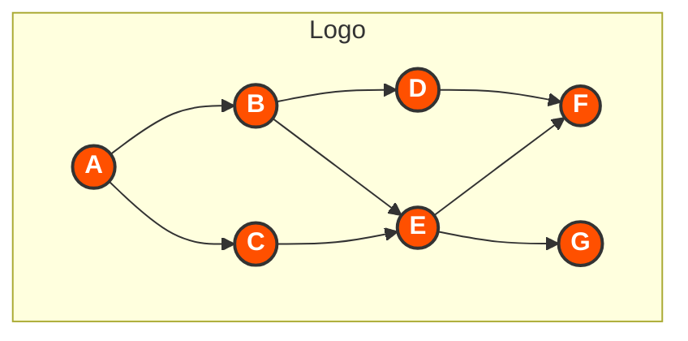

# Avalanche Parallel DAG Implementation

<div align="center">



*A high-performance, scalable implementation of Directed Acyclic Graph (DAG) processing for the Avalanche consensus protocol*

</div>

## 📋 Overview

This project implements an optimized version of the Directed Acyclic Graph (DAG) for the Avalanche consensus protocol using parallel processing techniques. It significantly improves transaction throughput and reduces confirmation latency by leveraging:

- Multi-threaded processing within a single node
- Distributed processing across multiple Kubernetes worker pods
- Efficient frontier management for optimal parallel execution

## 🚀 Installation and Setup Guide

This section provides comprehensive instructions for installing, building, and running the Avalanche Parallel DAG system.

### Prerequisites

- Go 1.18 (specifically requires Go 1.18, not later versions)
- Git
- Docker and Docker Compose (for containerized deployment)
- 4GB+ RAM
- 20GB+ free disk space

### Quick Start Guide

For the fastest setup experience, follow these steps:

```bash
# 1. Clone the repository
git clone https://github.com/Final-Project-13520137/avalanche-parallel-dag.git
cd avalanche-parallel-dag

# 2. Fix Go compatibility (essential for Go 1.18)
# For Windows:
.\fix-go-version.ps1
.\fix-go-compatibility.ps1

# For Linux/macOS:
chmod +x fix-go-version.sh fix-go-compatibility.sh
./fix-go-version.sh
./fix-go-compatibility.sh

# 3. Build the binaries
# For Windows:
go build -o avalanche-parallel.exe .\cmd\avalanche
go build -o worker.exe .\cmd\worker

# For Linux/macOS:
go build -o avalanche-parallel ./cmd/avalanche
go build -o worker ./cmd/worker

# 4. Run the applications
# For Windows:
.\avalanche-parallel.exe --network-id=local --staking-enabled=false --http-port=9650
# In another terminal:
.\worker.exe --api-port=9652 --threads=4

# For Linux/macOS:
./avalanche-parallel --network-id=local --staking-enabled=false --http-port=9650
# In another terminal:
./worker --api-port=9652 --threads=4
```

### Detailed Installation Steps

#### Option 1: Clone Repository

```bash
# Clone the repository
git clone https://github.com/Final-Project-13520137/avalanche-parallel-dag.git
cd avalanche-parallel-dag

# Clone the Avalanche reference code into the default directory (if needed)
git clone https://github.com/ava-labs/avalanchego.git default
```

#### Option 2: Download Release

```bash
# Download the latest release
curl -LO https://github.com/Final-Project-13520137/avalanche-parallel-dag/archive/refs/tags/v1.0.0.tar.gz
tar -xzf v1.0.0.tar.gz
cd avalanche-parallel-dag-1.0.0
```

### Essential: Go Version Compatibility

This project requires Go 1.18 specifically. Follow these steps to ensure compatibility:

#### Step 1: Fix Go Module Version

```bash
# Windows (PowerShell)
.\fix-go-version.ps1

# Linux/macOS
chmod +x fix-go-version.sh
./fix-go-version.sh
```

This will:
- Update go.mod to use Go 1.18
- Remove any toolchain directives
- Run go mod tidy

#### Step 2: Fix Go Compatibility Issues

```bash
# Windows (PowerShell)
.\fix-go-compatibility.ps1

# Linux/macOS
chmod +x fix-go-compatibility.sh
./fix-go-compatibility.sh
```

This will:
- Create compatibility layers for newer Go packages (cmp, slices, maps)
- Fix sorting.go implementation issues
- Update set implementation for Go 1.18 compatibility

### Building from Source

After applying the compatibility fixes, build the binaries:

#### Build the Main Binary

```bash
# Windows (PowerShell)
go build -o avalanche-parallel.exe .\cmd\avalanche

# Linux/macOS
go build -o avalanche-parallel ./cmd/avalanche
```

#### Build Worker Nodes

```bash
# Windows (PowerShell)
go build -o worker.exe .\cmd\worker

# Linux/macOS
go build -o worker ./cmd/worker
```

### Running the System

#### Starting the Node (Standalone)

```bash
# Windows
.\avalanche-parallel.exe --network-id=local --staking-enabled=false --http-port=9650

# Linux/macOS
./avalanche-parallel --network-id=local --staking-enabled=false --http-port=9650
```

#### Starting Worker Nodes (Standalone)

```bash
# Windows
.\worker.exe --api-port=9652 --threads=4

# Linux/macOS
./worker --api-port=9652 --threads=4
```

#### Using Docker Compose (Recommended)

Before using Docker Compose, ensure you've applied the compatibility fixes:

```bash
# Fix Go compatibility first
# Windows:
.\fix-go-version.ps1
.\fix-go-compatibility.ps1
# Linux/macOS:
chmod +x fix-go-version.sh fix-go-compatibility.sh
./fix-go-version.sh
./fix-go-compatibility.sh

# Then start the Docker services
docker-compose up -d

# Scale worker nodes
docker-compose up -d --scale worker=3

# Check service status
docker-compose ps

# View logs
docker-compose logs -f

# Stop all services
docker-compose down
```

### Running with Modified Ports

If you encounter port conflicts, use our restart scripts:

```bash
# Windows (PowerShell)
.\restart-docker.ps1

# Linux/macOS
chmod +x restart-docker.sh
./restart-docker.sh
```

### Running Tests

Before running tests, make sure you've applied the compatibility fixes:

```bash
# Fix Go compatibility first
# Windows:
.\fix-go-version.ps1
.\fix-go-compatibility.ps1
# Linux/macOS:
chmod +x fix-go-version.sh fix-go-compatibility.sh
./fix-go-version.sh
./fix-go-compatibility.sh

# Then run tests
# Run all blockchain tests
go test -v github.com/Final-Project-13520137/avalanche-parallel-dag/pkg/blockchain

# Run specific test categories
go test -v github.com/Final-Project-13520137/avalanche-parallel-dag/pkg/blockchain -run TestTransaction
go test -v github.com/Final-Project-13520137/avalanche-parallel-dag/pkg/blockchain -run TestBlock
go test -v github.com/Final-Project-13520137/avalanche-parallel-dag/pkg/blockchain -run TestBlockchain

# Using test script (Windows)
.\runtest.ps1

# Using test script (Linux/macOS)
chmod +x restart.sh
./restart.sh
```

### Running Benchmarks

```bash
# Run benchmarks with 1000 vertices and 4 threads
go run ./cmd/benchmark -vertices=1000 -threads=4
```

### Accessing Services

Once running, you can access the following services:

- **Avalanche Node API**: http://localhost:9650/ext/info
- **Worker API**: http://localhost:9652/health
- **Prometheus**: http://localhost:19090 (modified port to avoid conflicts)
- **Grafana**: http://localhost:13000 (modified port to avoid conflicts)
  - Default credentials: username `admin`, password `admin`

### Troubleshooting Common Issues

#### 1. Module Path Issues

If you encounter module path errors:

```bash
# Windows (PowerShell)
.\fix-module-path.ps1

# Linux/macOS
chmod +x fix-module-path.sh
./fix-module-path.sh
```

#### 2. Import Path Issues

For import path errors:

```bash
# Windows (PowerShell)
.\fix-all-imports.ps1

# Linux/macOS
chmod +x fix-all-imports.sh
./fix-all-imports.sh
```

#### 3. Go Version Issues

If you see errors about incompatible Go versions:

```bash
# Windows (PowerShell)
.\fix-go-version.ps1

# Linux/macOS
chmod +x fix-go-version.sh
./fix-go-version.sh
```

#### 4. Docker Compose Issues

For Docker Compose issues:

```bash
# Rebuild containers with specific arguments
docker-compose build --build-arg AVALANCHE_PARALLEL_PATH=../avalanche-parallel

# Or use our restart script
# Windows (PowerShell)
.\restart-docker.ps1

# Linux/macOS
chmod +x restart-docker.sh
./restart-docker.sh
```

#### 5. Sorting Errors with bytes.Compare

If you encounter syntax errors in sorting.go:

```bash
# Windows (PowerShell)
.\fix-sorting.ps1

# Linux/macOS - manually fix by copying sorting_fixed.go
cp sorting_fixed.go default/utils/sorting.go
```

#### 6. Missing Package Errors (cmp, maps, slices)

Apply the compatibility fixes to create compatible implementations:

```bash
# Windows (PowerShell)
.\fix-go-compatibility.ps1

# Linux/macOS
chmod +x fix-go-compatibility.sh
./fix-go-compatibility.sh
```

This will create:
- cmp_compatibility.go
- maps_compatibility.go  
- slices_compatibility.go

## ✨ Features

<table>
  <tr>
    <td align="center"><b>⚡ Parallel Processing</b></td>
    <td>Process multiple vertices simultaneously to improve throughput</td>
  </tr>
  <tr>
    <td align="center"><b>🌐 Distributed Workers</b></td>
    <td>Scale processing across multiple pods for unlimited capacity</td>
  </tr>
  <tr>
    <td align="center"><b>♾️ Auto-Scaling</b></td>
    <td>Automatically adapt to workload with Kubernetes HPA</td>
  </tr>
  <tr>
    <td align="center"><b>🛡️ Fault Tolerance</b></td>
    <td>Continue operation even when individual worker pods fail</td>
  </tr>
  <tr>
    <td align="center"><b>📊 Performance Monitoring</b></td>
    <td>Built-in metrics and benchmarking capabilities</td>
  </tr>
</table>

## 📋 Quick Reference Commands

Here's a simplified cheat sheet for building and running the project with Go 1.18:

### Step 1: Setup & Fix Compatibility

```bash
# Clone repository and enter directory
git clone https://github.com/Final-Project-13520137/avalanche-parallel-dag.git
cd avalanche-parallel-dag

# Windows (PowerShell)
.\fix-go-version.ps1
.\fix-go-compatibility.ps1

# Linux/macOS
chmod +x fix-go-version.sh fix-go-compatibility.sh
./fix-go-version.sh
./fix-go-compatibility.sh
```

### Step 2: Build Binaries

```bash
# Windows (PowerShell)
go build -o avalanche-parallel.exe .\cmd\avalanche
go build -o worker.exe .\cmd\worker

# Linux/macOS
go build -o avalanche-parallel ./cmd/avalanche
go build -o worker ./cmd/worker
```

### Step 3: Run the Application

```bash
# Option 1: Run standalone (in separate terminals)
# Windows:
.\avalanche-parallel.exe --network-id=local --staking-enabled=false --http-port=9650
.\worker.exe --api-port=9652 --threads=4

# Linux/macOS:
./avalanche-parallel --network-id=local --staking-enabled=false --http-port=9650
./worker --api-port=9652 --threads=4

# Option 2: Run with Docker Compose
docker-compose up -d
```

### Step 4: Run Tests (Optional)

```bash
# Run test with script
# Windows:
.\runtest.ps1

# Linux/macOS:
chmod +x restart.sh
./restart.sh

# Or run individual tests
go test -v github.com/Final-Project-13520137/avalanche-parallel-dag/pkg/blockchain
```

### Troubleshooting

If you encounter any issues, these commands may help:

```bash
# Fix sorting errors
# Windows:
.\fix-sorting.ps1
# Linux/macOS:
cp sorting_fixed.go default/utils/sorting.go

# Fix module path issues
# Windows:
.\fix-module-path.ps1
# Linux/macOS:
chmod +x fix-module-path.sh
./fix-module-path.sh

# Fix import path issues
# Windows:
.\fix-all-imports.ps1
# Linux/macOS:
chmod +x fix-all-imports.sh
./fix-all-imports.sh
```

For more detailed information, refer to the appropriate sections in this README.