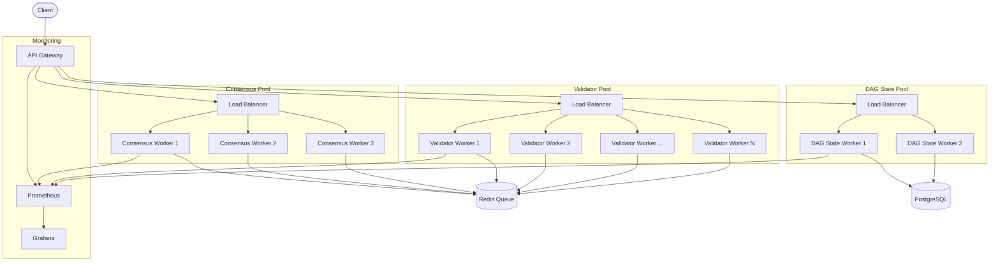
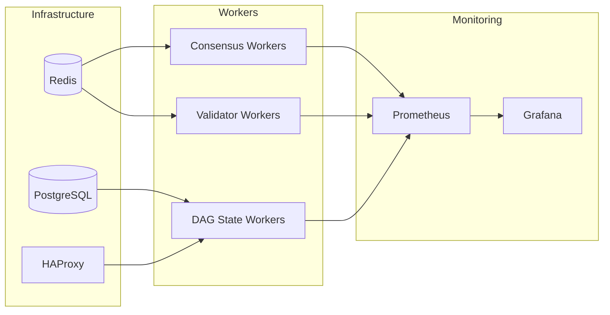
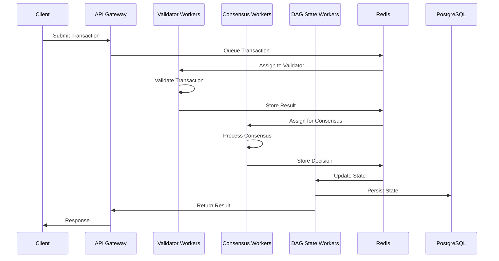
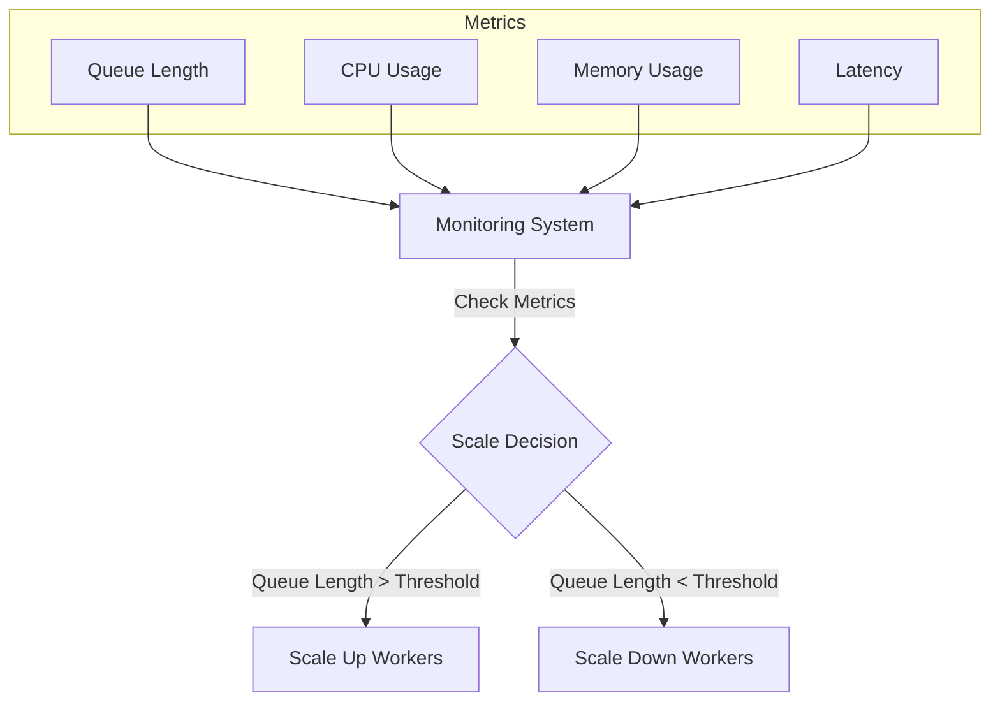
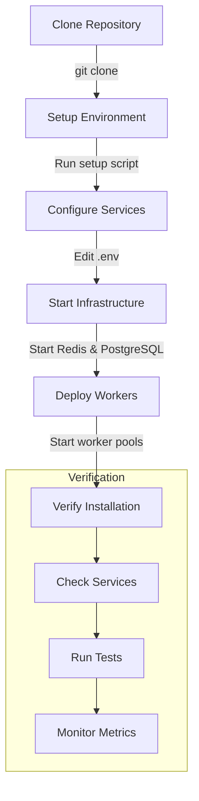

# Avalanche Parallel Processing System

Sistem pemrosesan paralel untuk Avalanche blockchain yang menggunakan arsitektur microservices untuk meningkatkan throughput dan skalabilitas.

## 📑 Daftar Isi
- [Gambaran Umum](#gambaran-umum)
- [Arsitektur](#arsitektur)
- [Alur Kerja](#alur-kerja)
- [Prasyarat](#prasyarat)
- [Instalasi](#instalasi)
- [Penggunaan](#penggunaan)
- [Konfigurasi](#konfigurasi)
- [Monitoring](#monitoring)
- [Benchmark](#benchmark)
- [Troubleshooting](#troubleshooting)
- [Kontribusi](#kontribusi)

## 🔍 Gambaran Umum

Sistem ini dirancang untuk meningkatkan kinerja Avalanche blockchain dengan memparalelkan proses validasi dan konsensus. Sistem terdiri dari beberapa komponen utama:

- **API Gateway**: Titik masuk utama untuk semua permintaan
- **Consensus Workers**: Menangani proses konsensus secara paralel
- **Validator Workers**: Memvalidasi transaksi secara paralel
- **DAG State Workers**: Mengelola state DAG (Directed Acyclic Graph)
- **Monitoring Stack**: Prometheus dan Grafana untuk monitoring

## 📐 Arsitektur

### Arsitektur Sistem


```mermaid
graph TB
    Client([Client]) --> Gateway[API Gateway]
    Gateway --> LB1[Load Balancer]
    Gateway --> LB2[Load Balancer]
    Gateway --> LB3[Load Balancer]
    
    subgraph Consensus Pool
        LB1 --> CW1[Consensus Worker 1]
        LB1 --> CW2[Consensus Worker 2]
        LB1 --> CW3[Consensus Worker 3]
    end
    
    subgraph Validator Pool
        LB2 --> VW1[Validator Worker 1]
        LB2 --> VW2[Validator Worker 2]
        LB2 --> VW3[Validator Worker ...]
        LB2 --> VW4[Validator Worker N]
    end
    
    subgraph DAG State Pool
        LB3 --> DW1[DAG State Worker 1]
        LB3 --> DW2[DAG State Worker 2]
    end
    
    CW1 & CW2 & CW3 --> Redis[(Redis Queue)]
    VW1 & VW2 & VW3 & VW4 --> Redis
    DW1 & DW2 --> Postgres[(PostgreSQL)]
    
    subgraph Monitoring
        Prometheus[Prometheus] --> Grafana[Grafana]
        Gateway & CW1 & VW1 & DW1 --> Prometheus
    end
```

### Komponen Utama


```mermaid
graph LR
    subgraph Infrastructure
        Redis[(Redis)]
        Postgres[(PostgreSQL)]
        HAProxy[HAProxy]
    end
    
    subgraph Workers
        CW[Consensus Workers]
        VW[Validator Workers]
        DW[DAG State Workers]
    end
    
    subgraph Monitoring
        Prom[Prometheus]
        Graf[Grafana]
    end
    
    Redis --> CW & VW
    Postgres --> DW
    HAProxy --> DW
    CW & VW & DW --> Prom
    Prom --> Graf
```

## 🔄 Alur Kerja

### Alur Pemrosesan Transaksi


```mermaid
sequenceDiagram
    participant C as Client
    participant G as API Gateway
    participant V as Validator Workers
    participant Co as Consensus Workers
    participant D as DAG State Workers
    participant R as Redis
    participant P as PostgreSQL

    C->>G: Submit Transaction
    G->>R: Queue Transaction
    R->>V: Assign to Validator
    V->>V: Validate Transaction
    V->>R: Store Result
    R->>Co: Assign for Consensus
    Co->>Co: Process Consensus
    Co->>R: Store Decision
    R->>D: Update State
    D->>P: Persist State
    D->>G: Return Result
    G->>C: Response
```

### Alur Scaling


```mermaid
graph TD
    Monitor[Monitoring System] -->|Check Metrics| Decision{Scale Decision}
    Decision -->|Queue Length > Threshold| ScaleUp[Scale Up Workers]
    Decision -->|Queue Length < Threshold| ScaleDown[Scale Down Workers]
    
    subgraph Metrics
        QLen[Queue Length]
        CPU[CPU Usage]
        Mem[Memory Usage]
        Lat[Latency]
    end
    
    QLen & CPU & Mem & Lat --> Monitor
```

## ⚙️ Prasyarat

1. **Docker & Docker Compose**
   - Docker Desktop untuk Windows/Mac
   - Docker Engine & Docker Compose untuk Linux
   - Minimum versi:
     - Docker: 20.10.0+
     - Docker Compose: 2.0.0+

2. **Hardware Requirements**
   - CPU: Minimum 4 cores
   - RAM: Minimum 8GB
   - Storage: 50GB+ free space

3. **Network Requirements**
   - Ports:
     ```mermaid
     graph LR
         subgraph External Ports
             P1[9650: API Gateway]
             P2[9750: Metrics]
             P3[3000: Grafana]
             P4[9090: Prometheus]
         end
         
         subgraph Internal Ports
             P5[6379: Redis]
             P6[5432: PostgreSQL]
             P7[8082: DAG State]
         end
     ```

## 🚀 Instalasi

### Langkah-langkah Instalasi


```mermaid
graph TD
    A[Clone Repository] -->|git clone| B[Setup Environment]
    B -->|Run setup script| C[Configure Services]
    C -->|Edit .env| D[Start Infrastructure]
    D -->|Start Redis & PostgreSQL| E[Deploy Workers]
    E -->|Start worker pools| F[Verify Installation]
    
    subgraph Verification
        F --> G[Check Services]
        G --> H[Run Tests]
        H --> I[Monitor Metrics]
    end
```

### 1. Clone Repository

```bash
git clone https://github.com/your-org/avalanche-parallel.git
cd avalanche-parallel/microservices
```

### 2. Setup Environment

```bash
# Windows (PowerShell)
.\scripts\setup\setup-environment.ps1

# Linux/macOS
./scripts/setup/setup-environment.sh
```

### 3. Konfigurasi

1. **Salin file konfigurasi contoh**
```bash
   cp .env.example .env
   ```

2. **Sesuaikan konfigurasi di .env**
   ```env
   REDIS_PASSWORD=your_secure_password
   POSTGRES_PASSWORD=your_secure_password
LOG_LEVEL=info
```

## Penggunaan

### 1. Menjalankan Sistem

#### Menggunakan Script Helper

```bash
# Windows (PowerShell)
.\run-worker-pools.ps1

# Linux/macOS
./run-worker-pools.sh
```

#### Manual dengan Docker Compose

```bash
# Mode development (dengan log)
docker-compose -f docker-compose.worker-pools.yml up

# Mode production (background)
docker-compose -f docker-compose.worker-pools.yml up -d
```

### 2. Menghentikan Sistem

#### Menggunakan Script Helper

```bash
# Windows (PowerShell)
.\cleanup-worker-pools.ps1

# Linux/macOS
./cleanup-worker-pools.sh
```

#### Manual dengan Docker Compose

```bash
docker-compose -f docker-compose.worker-pools.yml down
```

### 3. Scaling Workers

```bash
# Scale validator workers
docker-compose -f docker-compose.worker-pools.yml up -d --scale validator-worker=10

# Scale consensus workers
docker-compose -f docker-compose.worker-pools.yml up -d --scale consensus-worker=5
```

## Konfigurasi

### 1. Worker Pools

File: `docker-compose.worker-pools.yml`

```yaml
# Contoh konfigurasi worker
validator-worker:
  environment:
    - MAX_WORKERS=15        # Jumlah thread per container
    - BATCH_SIZE=100        # Ukuran batch transaksi
    - TIMEOUT=30s          # Timeout per operasi
```

### 2. Load Balancer

File: `loadbalancer/dag-state-haproxy.cfg`

```haproxy
# Contoh konfigurasi HAProxy
backend dag_state_workers
    balance roundrobin
    option httpchk GET /health
    server worker1 dag-state-worker-1:8082 check
    server worker2 dag-state-worker-2:8082 check
```

### 3. Monitoring

File: `monitoring/prometheus-worker.yml`

```yaml
# Contoh konfigurasi Prometheus
scrape_configs:
  - job_name: 'workers'
    scrape_interval: 15s
    static_configs:
      - targets: ['validator-worker-1:8080', 'consensus-worker-1:8080']
```

## Monitoring

### 1. Akses Dashboard

- Grafana: http://localhost:3000 (admin/admin)
- Prometheus: http://localhost:9090
- HAProxy Stats: http://localhost:8404/stats

### 2. Metrik Utama

1. **Worker Metrics**
   - Queue Length
   - Processing Time
   - Error Rate
   - Throughput

2. **System Metrics**
   - CPU Usage
   - Memory Usage
   - Network I/O
   - Disk I/O

### 3. Alerts

Konfigurasi alert di `monitoring/alertmanager.yml`:

```yaml
# Contoh alert rule
groups:
  - name: worker_alerts
    rules:
      - alert: HighErrorRate
        expr: error_rate > 0.1
        for: 5m
```

## Benchmark

### 1. Menjalankan Benchmark

```bash
# Windows (PowerShell)
.\run-benchmark.ps1 -workers 10 -transactions 1000

# Linux/macOS
./run-benchmark.sh -w 10 -t 1000
```

### 2. Hasil Benchmark

Hasil benchmark akan tersimpan di:
- `benchmark-results/`: Data mentah
- `benchmark-results/graphs/`: Visualisasi
- Grafana Dashboard: "Benchmark Results"

## Troubleshooting

Lihat [DOCKER-TROUBLESHOOTING.md](DOCKER-TROUBLESHOOTING.md) untuk panduan lengkap mengatasi masalah umum.

### Masalah Umum

1. **Container Tidak Berjalan**
```bash
   # Cek logs
   docker-compose -f docker-compose.worker-pools.yml logs

   # Restart specific service
   docker-compose -f docker-compose.worker-pools.yml restart validator-worker-1
   ```

2. **Performa Lambat**
   - Cek resource usage dengan `docker stats`
   - Sesuaikan `MAX_WORKERS` dan `BATCH_SIZE`
   - Optimalkan query database

3. **Network Issues**
```bash
   # Cek network
   docker network inspect microservices_avalanche-net

   # Recreate network
   docker-compose -f docker-compose.worker-pools.yml down
   docker network prune
   docker-compose -f docker-compose.worker-pools.yml up -d
   ```

## Kontribusi

1. Fork repository
2. Buat feature branch
3. Commit perubahan
4. Push ke branch
5. Buat Pull Request

### Coding Standards

- Go: Ikuti [Effective Go](https://golang.org/doc/effective_go)
- Docker: Ikuti [Best Practices](https://docs.docker.com/develop/develop-images/dockerfile_best-practices/)
- Commit: Gunakan [Conventional Commits](https://www.conventionalcommits.org/)

### Testing

```bash
# Unit tests
go test ./...

# Integration tests
./scripts/integration-tests.sh

# Benchmark tests
./scripts/benchmark-tests.sh
``` 