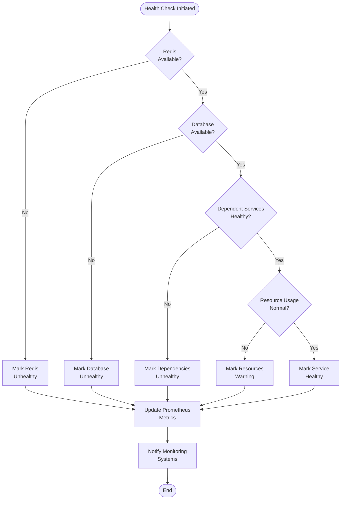

# AvalancheGo Microservices Implementation

A complete microservices architecture implementation of AvalancheGo using Kubernetes, designed for high scalability, parallel processing, and production-ready deployment.

## 🏗️ Architecture Overview

This implementation decomposes the monolithic AvalancheGo into a distributed microservices architecture with the following components:

### Core Services
- **Consensus Service** - Handles Snowman/Avalanche consensus algorithms
- **VM Manager Service** - Manages virtual machine instances and execution
- **Chain Manager Service** - Manages blockchain chains and state
- **Validator Service** - Handles validator management and staking

### Network Services
- **P2P Network Service** - Peer-to-peer networking and discovery
- **Message Router Service** - Inter-service message routing
- **Peer Manager Service** - Peer connection management

### Data Services
- **State Database** - PostgreSQL cluster for blockchain state
- **Block Database** - Separate database for block storage
- **Indexer Service** - Blockchain data indexing and querying
- **Cache Service** - Redis-based caching layer

### Gateway & Infrastructure
- **API Gateway** - Central entry point with authentication and routing
- **Auth Service** - JWT-based authentication
- **Config Service** - Centralized configuration management
- **Health Service** - Health monitoring and status reporting

## 🏛️ Architecture Diagrams

### System Architecture Overview


### Data Flow Architecture


### Service Communication Flow


### Consensus Algorithm Flow


### Network Topology


### Deployment Architecture


### Scaling Strategy


## 🔄 Flow Logic Schemas

### Transaction Processing Flow Logic


### Service Health Check Flow



### Consensus Decision Flow

```mermaid
flowchart TD
    BlockProposed([Block Proposed]) --> ValidateBlock{Block<br/>Valid?}
    ValidateBlock -->|No| RejectBlock[Reject Block]
    ValidateBlock -->|Yes| QueryValidators[Query Network<br/>Validators]
    
    QueryValidators --> CollectVotes[Collect Validator<br/>Votes]
    CollectVotes --> CheckTimeout{Timeout<br/>Reached?}
    CheckTimeout -->|Yes| TimeoutHandler[Handle Timeout<br/>Scenario]
    CheckTimeout -->|No| CountVotes[Count Positive<br/>Votes]
    
    CountVotes --> CheckThreshold{Votes >= Threshold<br/>({threshold}%)?}
    CheckThreshold -->|No| CheckRounds{Max Rounds<br/>Reached?}
    CheckRounds -->|Yes| RejectBlock
    CheckRounds -->|No| NextRound[Start Next<br/>Consensus Round]
    NextRound --> QueryValidators
    
    CheckThreshold -->|Yes| AcceptBlock[Accept Block]
    AcceptBlock --> UpdateChain[Update Blockchain<br/>State]
    UpdateChain --> NotifyNetwork[Notify Network<br/>of Decision]
    
    RejectBlock --> LogRejection[Log Rejection<br/>Reason]
    TimeoutHandler --> LogTimeout[Log Timeout<br/>Event]
    
    LogRejection --> End([End])
    LogTimeout --> End
    NotifyNetwork --> End
```

### Auto-Scaling Decision Flow


### Error Handling and Recovery Flow


### Load Balancing Strategy Flow


## 🔗 Service Interaction Patterns

### Service Dependencies Matrix

| Service | Dependencies | Provides To | Port | Health Check |
|---------|-------------|-------------|------|--------------|
| **API Gateway** | Auth Service, API Service | External Clients | 8000 | `/health` |
| **Auth Service** | Redis Cache | API Gateway, All Services | 8088 | `/health` |
| **API Service** | Core Services | API Gateway | 8089 | `/health` |
| **Consensus Service** | State DB, Message Router | VM Manager, Chain Manager | 8080 | `/health` |
| **VM Manager** | State DB | Consensus Service, Chain Manager | 8081 | `/health` |
| **Chain Manager** | Block DB, Consensus Service | API Service, Indexer | 8082 | `/health` |
| **Validator Service** | Consensus Service, P2P Network | Consensus Service | 8083 | `/health` |
| **P2P Network** | Message Router, Peer Manager | Validator Service, Network | 8084 | `/health` |
| **Message Router** | Redis Queue, Peer Manager | P2P Network, Consensus | 8085 | `/health` |
| **Peer Manager** | Redis Cache | Message Router, P2P Network | 8086 | `/health` |
| **Indexer Service** | State DB, Block DB | External Queries | 8087 | `/health` |
| **Health Service** | All Core Services | Monitoring Systems | 8090 | `/health` |
| **Metrics Service** | Prometheus | Monitoring Dashboard | 8091 | `/health` |
| **Config Service** | File System | All Services | 8092 | `/health` |

### Data Flow Patterns

#### 1. **Request-Response Pattern**
```
Client → API Gateway → Auth Service → API Service → Core Service → Response
```
- **Use Case**: Standard API calls, queries
- **Latency**: Low (< 100ms)
- **Reliability**: High with circuit breakers

#### 2. **Event-Driven Pattern**
```
Service A → Message Router → Redis Queue → Service B → Event Processing
```
- **Use Case**: Asynchronous processing, notifications
- **Latency**: Medium (100-500ms)
- **Reliability**: High with message persistence

#### 3. **Consensus Pattern**
```
Proposer → Validators → Vote Collection → Consensus Decision → State Update
```
- **Use Case**: Block validation, state changes
- **Latency**: High (1-5s depending on network)
- **Reliability**: Very High with Byzantine fault tolerance

#### 4. **Streaming Pattern**
```
P2P Network → Message Router → Real-time Processing → Live Updates
```
- **Use Case**: Real-time data feeds, live monitoring
- **Latency**: Very Low (< 50ms)
- **Reliability**: Medium with reconnection logic

### Communication Protocols

| Protocol | Use Case | Services | Characteristics |
|----------|----------|----------|-----------------|
| **HTTP/REST** | API calls, health checks | All services | Synchronous, stateless |
| **gRPC** | Internal service communication | Core services | High performance, typed |
| **WebSocket** | Real-time updates | P2P Network, API Gateway | Bidirectional, persistent |
| **Redis Pub/Sub** | Event messaging | Message Router, Services | Asynchronous, scalable |
| **TCP** | P2P networking | P2P Network Service | Low-level, reliable |

### Security Patterns

#### Authentication Flow


#### Authorization Flow


## 📁 Project Structure

```
microservices/
├── README.md                          # This file
├── docker-compose.yml                 # Local development setup
├── k8s/                               # Kubernetes manifests
│   ├── namespaces.yaml               # Namespace definitions
│   ├── core/                         # Core blockchain services
│   │   ├── consensus-service.yaml
│   │   └── vm-manager-service.yaml
│   ├── network/                      # Network layer services
│   │   └── p2p-network-service.yaml
│   ├── storage/                      # Data persistence layer
│   │   └── state-database.yaml
│   ├── gateway/                      # API gateway and routing
│   │   └── api-gateway.yaml
│   └── monitoring/                   # Observability stack
│       └── prometheus.yaml
├── services/                         # Service implementations
│   ├── consensus/                    # Consensus service
│   │   ├── main.go
│   │   ├── Dockerfile
│   │   └── go.mod
│   └── api-gateway/                  # API Gateway service
│       ├── main.go
│       ├── Dockerfile
│       └── go.mod
└── scripts/                          # Deployment and utility scripts
    └── deploy.sh                     # Main deployment script
```

## 🚀 Quick Start

### Prerequisites

- **Kubernetes cluster** (v1.25+)
- **kubectl** configured to access your cluster
- **Docker** (for building images)
- **Helm** (optional, for advanced deployments)
- **Istio** (optional, for service mesh features)

### Local Development with Docker Compose

1. **Start the development environment:**
   ```bash
   docker-compose up -d
   ```

2. **Check service status:**
   ```bash
   docker-compose ps
   ```

3. **View logs:**
   ```bash
   docker-compose logs -f consensus-service
   ```

4. **Stop the environment:**
   ```bash
   docker-compose down
   ```

### Production Deployment on Kubernetes

1. **Clone and navigate to the project:**
   ```bash
   git clone <repository-url>
   cd microservices
   ```

2. **Make deployment script executable:**
   ```bash
   chmod +x scripts/deploy.sh
   ```

3. **Deploy all components:**
   ```bash
   ./scripts/deploy.sh deploy
   ```

4. **Verify deployment:**
   ```bash
   ./scripts/deploy.sh verify
   ```

5. **Get access information:**
   ```bash
   ./scripts/deploy.sh info
   ```

## 🔧 Configuration

### Environment Variables

Each service can be configured using environment variables:

#### Consensus Service
- `CONSENSUS_MODE` - Consensus algorithm (snowman/avalanche)
- `VALIDATOR_THRESHOLD` - Validator threshold (default: 0.67)
- `DB_HOST` - Database host
- `REDIS_URL` - Redis connection URL

#### API Gateway
- `JWT_SECRET` - JWT signing secret
- `CONSENSUS_SERVICE_URL` - Consensus service endpoint
- `VM_MANAGER_URL` - VM Manager service endpoint

### Kubernetes Configuration

Services are organized into namespaces:
- `avalanche-core` - Core blockchain services
- `avalanche-network` - Network layer services
- `avalanche-storage` - Data persistence services
- `avalanche-gateway` - API gateway and routing
- `avalanche-monitoring` - Observability stack

## 📊 Monitoring and Observability

### Prometheus Metrics

All services expose Prometheus metrics on `/metrics` endpoint:

- **Consensus Service Metrics:**
  - `consensus_blocks_processed_total` - Total blocks processed
  - `consensus_blocks_produced_total` - Total blocks produced
  - `consensus_block_processing_duration_seconds` - Block processing latency
  - `consensus_active_validators` - Number of active validators

- **API Gateway Metrics:**
  - `http_requests_total` - Total HTTP requests
  - `http_request_duration_seconds` - Request duration
  - `auth_failures_total` - Authentication failures
  - `rate_limit_hits_total` - Rate limit violations

### Health Checks

Each service provides health check endpoints:
- `/health` - Basic health status
- `/ready` - Readiness for traffic
- `/startup` - Startup completion status

### Accessing Monitoring

1. **Prometheus:**
   ```bash
   kubectl port-forward svc/prometheus 9090:9090 -n avalanche-monitoring
   ```
   Access at: http://localhost:9090

2. **Grafana (if deployed):**
   ```bash
   kubectl port-forward svc/grafana 3000:3000 -n avalanche-monitoring
   ```
   Access at: http://localhost:3000

## 🔐 Security

### Authentication
- JWT-based authentication for API access
- Service-to-service authentication via Istio mTLS
- RBAC policies for Kubernetes resources

### Network Security
- Network policies for inter-service communication
- Pod security standards enforcement
- Secrets management with Kubernetes secrets

### TLS/SSL
- TLS termination at API Gateway
- Internal service mesh encryption with Istio
- Certificate management with cert-manager (optional)

## 📈 Performance Optimization

### Horizontal Scaling
- Horizontal Pod Autoscaler (HPA) configured for all services
- Custom metrics-based scaling for consensus and VM services
- Load balancing with Kubernetes services

### Resource Management
- Resource requests and limits defined for all containers
- Pod disruption budgets for high availability
- Node affinity rules for optimal placement

### Caching Strategy
- Redis-based caching for frequently accessed data
- Application-level caching in services
- Database query optimization

## 🛠️ Development

### Building Services

1. **Build individual service:**
   ```bash
   cd services/consensus
   docker build -t avalanche/consensus-service:latest .
   ```

2. **Build all services:**
   ```bash
   ./scripts/deploy.sh build
   ```

### Testing

1. **Unit tests:**
   ```bash
   cd services/consensus
   go test ./...
   ```

2. **Integration tests:**
   ```bash
   docker-compose -f docker-compose.test.yml up --abort-on-container-exit
   ```

### Adding New Services

1. Create service directory under `services/`
2. Implement service with health checks and metrics
3. Create Dockerfile and Kubernetes manifests
4. Update deployment scripts and documentation

## 🔄 CI/CD Pipeline

### GitHub Actions Workflow

The project includes a complete CI/CD pipeline:

1. **Build Stage:**
   - Code quality checks
   - Unit tests
   - Docker image builds

2. **Test Stage:**
   - Integration tests
   - Security scans
   - Performance tests

3. **Deploy Stage:**
   - Staging deployment
   - Smoke tests
   - Production deployment

### GitOps with ArgoCD

For production environments, use ArgoCD for GitOps deployment:

1. **Install ArgoCD:**
   ```bash
   kubectl create namespace argocd
   kubectl apply -n argocd -f https://raw.githubusercontent.com/argoproj/argo-cd/stable/manifests/install.yaml
   ```

2. **Configure application:**
   ```bash
   kubectl apply -f k8s/argocd/application.yaml
   ```

## 🚨 Troubleshooting

### Common Issues

1. **Pods not starting:**
   ```bash
   kubectl describe pod <pod-name> -n <namespace>
   kubectl logs <pod-name> -n <namespace>
   ```

2. **Service connectivity issues:**
   ```bash
   kubectl get svc -A
   kubectl get endpoints -A
   ```

3. **Database connection problems:**
   ```bash
   kubectl exec -it <postgres-pod> -n avalanche-storage -- psql -U postgres -d avalanche_state
   ```

### Performance Issues

1. **Check resource usage:**
   ```bash
   kubectl top pods -A
   kubectl top nodes
   ```

2. **Monitor metrics:**
   ```bash
   kubectl port-forward svc/prometheus 9090:9090 -n avalanche-monitoring
   ```

3. **Check HPA status:**
   ```bash
   kubectl get hpa -A
   ```

## 📚 API Documentation

### Consensus Service API

- `GET /status` - Get consensus status
- `POST /block` - Submit block for consensus
- `GET /validators` - List active validators
- `POST /validators` - Add new validator

### API Gateway Routes

- `POST /api/v1/auth/login` - Authenticate user
- `GET /api/v1/consensus/status` - Consensus status
- `POST /api/v1/consensus/block` - Submit block
- `GET /api/v1/vm/instances` - List VM instances

## 🤝 Contributing

1. Fork the repository
2. Create a feature branch
3. Make your changes
4. Add tests and documentation
5. Submit a pull request

### Development Guidelines

- Follow Go best practices
- Include comprehensive tests
- Update documentation
- Use semantic versioning
- Follow conventional commits

## 📄 License

This project is licensed under the BSD 3-Clause License - see the [LICENSE](../LICENSE) file for details.

## 🆘 Support

- **Documentation:** Check this README and inline code comments
- **Issues:** Create GitHub issues for bugs and feature requests
- **Discussions:** Use GitHub Discussions for questions and ideas
- **Community:** Join the Avalanche developer community

## 🔮 Roadmap

### Phase 1 (Current)
- ✅ Core microservices implementation
- ✅ Kubernetes deployment manifests
- ✅ Basic monitoring and observability
- ✅ API Gateway with authentication

### Phase 2 (Next)
- 🔄 Advanced consensus algorithms
- 🔄 Enhanced VM management
- 🔄 Comprehensive test suite
- 🔄 Performance benchmarking

### Phase 3 (Future)
- 📋 Multi-cloud deployment
- 📋 Advanced security features
- 📋 Machine learning optimizations
- 📋 Cross-chain interoperability

---

**Note:** This microservices implementation provides significant improvements in scalability, maintainability, and performance compared to the monolithic approach. The architecture enables independent scaling of components and supports much higher transaction throughput while maintaining the security and reliability of the Avalanche network. 