<div align="center">
  
</div>

---

# AvalancheGo - Node Implementation for Avalanche Network

Node implementation for the [Avalanche](https://avax.network) network - a blockchains platform with high throughput, and blazing fast transactions.

## 📋 Table of Contents

- [System Architecture Overview](#-system-architecture-overview)
- [Design System](#-design-system)
- [Core Components](#-core-components)
- [Code Flow Logic](#-code-flow-logic)
- [How It Works (Cara Kerja)](#-how-it-works-cara-kerja)
- [System Flow](#-system-flow)
- [Installation](#-installation)
- [Running Avalanche](#-running-avalanche)
- [Development Guide](#-development-guide)
- [API Documentation](#-api-documentation)
- [Security](#-security)

## 🏗️ System Architecture Overview

AvalancheGo implements a modular, layered architecture designed for high-performance blockchain operations. The system follows a microservices-like approach where each component has specific responsibilities and communicates through well-defined interfaces.

### High-Level Architecture Diagram

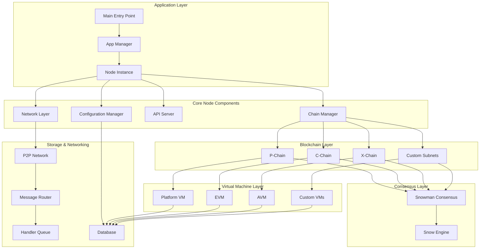

### Detailed Component Interaction

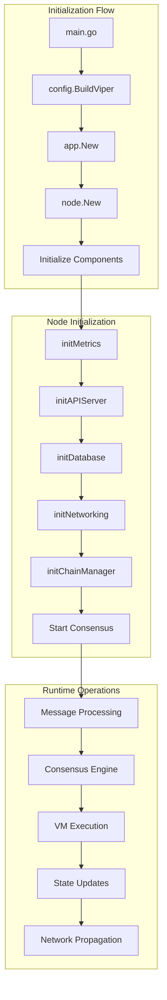

## 🎨 Design System

### Core Design Principles

1. **Modularity**: Each component is designed as an independent module with clear interfaces
2. **Scalability**: Architecture supports horizontal scaling through subnets
3. **Consensus Agnostic**: VMs can work with different consensus mechanisms
4. **Security First**: Multiple layers of validation and security checks
5. **Performance Optimized**: Efficient message passing and state management

### Component Hierarchy

```
AvalancheGo/
├── main/                    # Application entry point
├── app/                     # Application lifecycle management
├── node/                    # Core node implementation
├── chains/                  # Blockchain management
├── snow/                    # Consensus engine (Snowman/Avalanche)
│   ├── consensus/           # Consensus algorithms
│   ├── engine/              # Consensus engines
│   ├── networking/          # Network message handling
│   └── validators/          # Validator management
├── vms/                     # Virtual machines
│   ├── platformvm/          # Platform chain VM
│   ├── avm/                 # Asset VM (X-Chain)
│   ├── rpcchainvm/          # RPC chain VM wrapper
│   └── example/             # Example VMs
├── network/                 # P2P networking
│   ├── peer/                # Peer management
│   ├── throttling/          # Rate limiting
│   └── dialer/              # Connection management
├── api/                     # HTTP API endpoints
│   ├── server/              # API server
│   ├── health/              # Health checks
│   ├── info/                # Node information
│   └── admin/               # Administrative APIs
├── config/                  # Configuration management
├── database/                # Storage layer
└── utils/                   # Shared utilities
```

### Design Patterns Used

1. **Factory Pattern**: VM creation and management
2. **Observer Pattern**: Event handling and notifications
3. **Strategy Pattern**: Different consensus algorithms
4. **Chain of Responsibility**: Message routing
5. **Singleton Pattern**: Global configuration and logging

## 🔧 Core Components

### 1. Application Layer (`main/`, `app/`)

**Purpose**: Application lifecycle and process management

**Key Files**:
- `main/main.go`: Entry point, configuration parsing, version handling
- `app/app.go`: Application wrapper, signal handling, graceful shutdown

**Code Flow**:
```go
// main/main.go - Entry point
func main() {
    fs := config.BuildFlagSet()
    v, err := config.BuildViper(fs, os.Args[1:])
    
    nodeConfig, err := config.GetNodeConfig(v)
    nodeApp, err := app.New(nodeConfig)
    
    exitCode := app.Run(nodeApp)
    os.Exit(exitCode)
}

// app/app.go - Application lifecycle
func New(config nodeconfig.Config) (App, error) {
    logFactory := logging.NewFactory(config.LoggingConfig)
    n, err := node.New(&config, logFactory, log)
    return &app{node: n, log: log, logFactory: logFactory}, nil
}
```

**Responsibilities**:
- Parse command-line arguments and configuration
- Initialize logging and monitoring
- Manage application lifecycle (start/stop/restart)
- Handle system signals (SIGINT, SIGTERM, SIGABRT)

### 2. Node Core (`node/`)

**Purpose**: Central coordination of all node operations

**Initialization Sequence**:
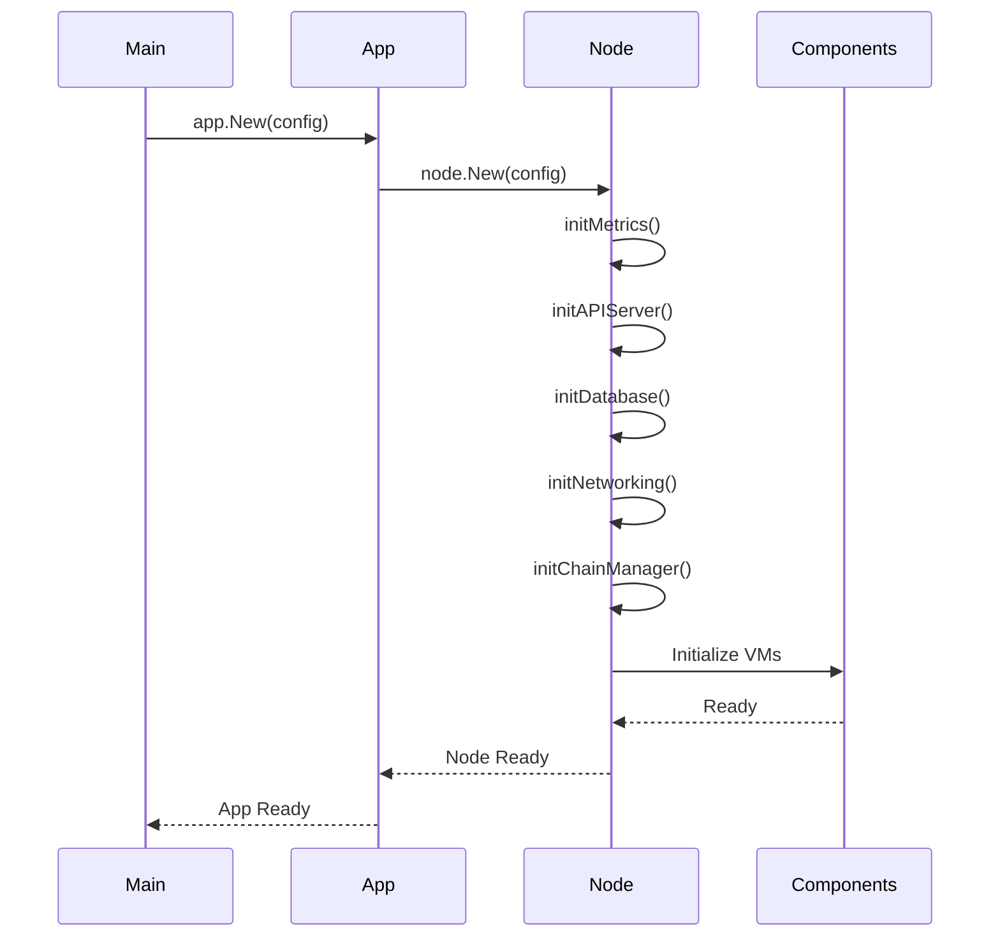

**Key Components**:
```go
// node/node.go - Node initialization
func New(config *node.Config, logFactory logging.Factory, logger logging.Logger) (*Node, error) {
    n := &Node{
        Log:              logger,
        LogFactory:       logFactory,
        StakingTLSSigner: config.StakingTLSCert.PrivateKey.(crypto.Signer),
        StakingTLSCert:   stakingCert,
        ID:               ids.NodeIDFromCert(stakingCert),
        Config:           config,
    }
    
    // Initialize components in order
    if err := n.initBootstrappers(); err != nil { return nil, err }
    if err := n.initMetrics(); err != nil { return nil, err }
    if err := n.initAPIServer(); err != nil { return nil, err }
    if err := n.initDatabase(); err != nil { return nil, err }
    if err := n.initNetworking(networkRegisterer); err != nil { return nil, err }
    if err := n.initChainManager(); err != nil { return nil, err }
    
    return n, nil
}
```

### 3. Consensus Engine (`snow/`)

**Purpose**: Implementation of Avalanche consensus protocols

**Key Features**:
- **Snowman**: Linear chain consensus (used by P-Chain, C-Chain, X-Chain)
- **Avalanche**: DAG-based consensus (legacy, now unified under Snowman)
- Validator sampling and polling
- Byzantine fault tolerance

**Consensus Flow**:
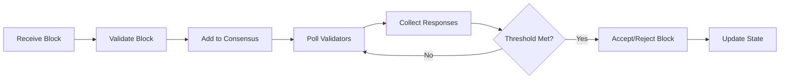

**Engine Start Process**:
```go
// snow/engine/snowman/engine.go
func (e *Engine) Start(ctx context.Context, startReqID uint32) error {
    e.requestID = startReqID
    lastAcceptedID, err := e.VM.LastAccepted(ctx)
    
    lastAccepted, err := e.VM.GetBlock(ctx, lastAcceptedID)
    lastAcceptedHeight := lastAccepted.Height()
    
    // Initialize consensus to the last accepted blockID
    if err := e.Consensus.Initialize(e.Ctx, e.Params, lastAcceptedID, lastAcceptedHeight, lastAccepted.Timestamp()); err != nil {
        return err
    }
    
    // Set VM preference
    if err := e.VM.SetPreference(ctx, lastAcceptedID); err != nil {
        return err
    }
    
    e.Ctx.State.Set(snow.EngineState{
        Type:  p2p.EngineType_ENGINE_TYPE_SNOWMAN,
        State: snow.NormalOp,
    })
    
    return e.VM.SetState(ctx, snow.NormalOp)
}
```

### 4. Virtual Machines (`vms/`)

**Purpose**: Blockchain-specific logic and state transitions

**Built-in VMs**:
- **Platform VM**: Manages validators, subnets, and staking
- **Contract VM (EVM)**: Ethereum-compatible smart contracts
- **Asset VM (AVM)**: Digital asset creation and transfer

**VM Interface**:
```go
type ChainVM interface {
    Initialize(ctx *snow.Context, db database.Database, genesisBytes []byte, upgradeBytes []byte, configBytes []byte, toEngine chan<- common.Message, fxs []*common.Fx, appSender common.AppSender) error
    BuildBlock() (snowman.Block, error)
    ParseBlock([]byte) (snowman.Block, error)
    GetBlock(ids.ID) (snowman.Block, error)
    SetPreference(ids.ID) error
    LastAccepted() (ids.ID, error)
}
```

**VM Initialization Example**:
```go
// vms/platformvm/vm.go
func (vm *VM) Initialize(ctx context.Context, chainCtx *snow.Context, db database.Database, genesisBytes []byte, ...) error {
    chainCtx.Log.Verbo("initializing platform chain")
    
    vm.ctx = chainCtx
    vm.db = db
    vm.codecRegistry = linearcodec.NewDefault()
    
    // Initialize state
    vm.state, err = state.New(vm.db, genesisBytes, registerer, vm.Internal.Validators, ...)
    
    // Initialize validator manager
    validatorManager := pvalidators.NewManager(vm.Internal, vm.state, vm.metrics, &vm.clock)
    vm.State = validatorManager
    
    // Initialize mempool
    mempool, err := pmempool.New("mempool", registerer)
    
    return nil
}
```

### 5. Networking (`network/`)

**Purpose**: P2P communication and message routing

**Key Features**:
- TLS-encrypted connections
- Message serialization/deserialization
- Peer discovery and management
- Bandwidth throttling
- Connection pooling

**Message Types**:
- Handshake messages
- State sync requests/responses
- Bootstrap requests/responses
- Consensus messages (polls, votes)
- Application-specific messages

**Network Initialization**:
```go
// network/network.go
func (n *network) Initialize(config Config) error {
    n.config = config
    n.peers = make(map[ids.NodeID]*peer)
    n.connectingPeers = make(map[ids.NodeID]*peer)
    
    // Initialize TLS configuration
    n.tlsConfig = &tls.Config{
        Certificates: []tls.Certificate{config.TLSCert},
        ClientAuth:   tls.RequireAndVerifyClientCert,
        ClientCAs:    config.TLSCertPool,
    }
    
    // Start listening for connections
    go n.listen()
    
    return nil
}
```

### 6. Chain Management (`chains/`)

**Purpose**: Lifecycle management of blockchains

**Chain Creation Flow**:
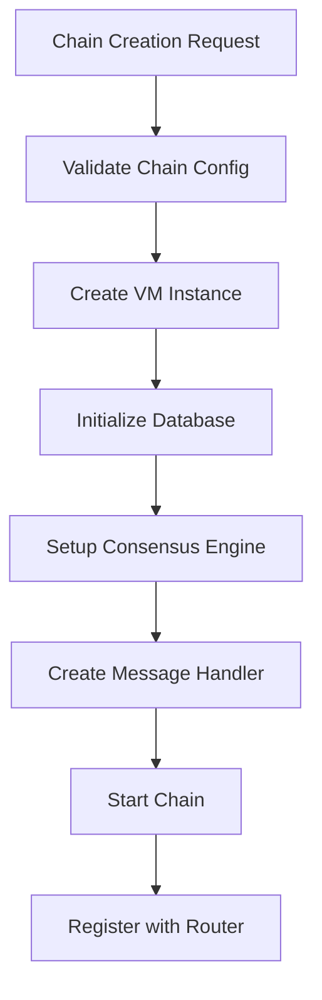

**Responsibilities**:
- Create and initialize new chains
- Route messages to appropriate chains
- Manage chain-specific resources
- Handle chain upgrades and migrations

## 🔄 Code Flow Logic

### Application Startup Flow

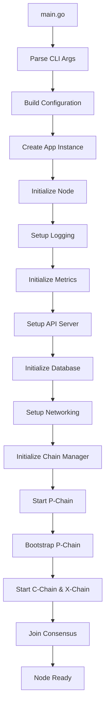

### Message Processing Flow

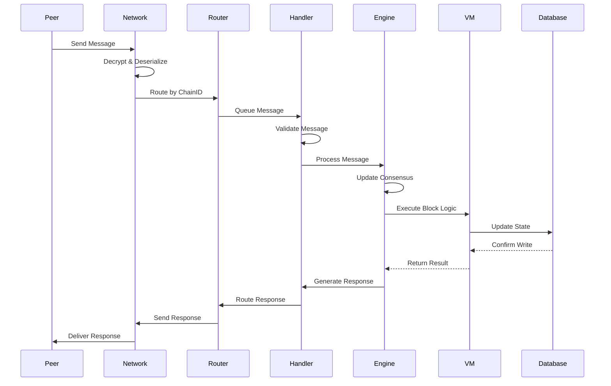

### Consensus Decision Flow

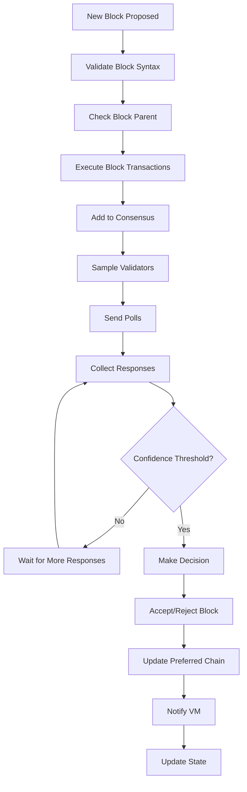

### VM Block Building Flow

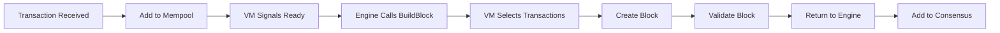

### Chain Router Message Flow

```go
// snow/networking/router/chain_router.go
func (cr *ChainRouter) HandleInbound(ctx context.Context, msg message.InboundMessage) {
    chainID, err := message.GetChainID(msg.Message())
    
    // Get the handler for this chain
    handler, exists := cr.chainHandlers[chainID]
    if !exists {
        cr.log.Debug("dropping message", zap.Stringer("chainID", chainID))
        return
    }
    
    // Route message to appropriate handler
    handler.Push(ctx, msg)
}
```

### Handler Message Processing

```go
// snow/networking/handler/handler.go
func (h *handler) dispatchSync(ctx context.Context) {
    for {
        select {
        case msg := <-h.syncMsgChan:
            h.handleSyncMsg(ctx, msg)
        case <-ctx.Done():
            return
        }
    }
}

func (h *handler) handleSyncMsg(ctx context.Context, msg message.InboundMessage) {
    switch msg := msg.Message().(type) {
    case *p2ppb.GetStateSummaryFrontier:
        h.handleGetStateSummaryFrontier(ctx, msg)
    case *p2ppb.StateSummaryFrontier:
        h.handleStateSummaryFrontier(ctx, msg)
    case *p2ppb.GetAcceptedStateSummary:
        h.handleGetAcceptedStateSummary(ctx, msg)
    // ... more message types
    }
}
```

## 🔄 How It Works (Cara Kerja)

### Startup Process (Proses Startup)

1. **Configuration Loading (Pemuatan Konfigurasi)**
   ```go
   // Parse command-line flags
   fs := config.BuildFlagSet()
   v, err := config.BuildViper(fs, os.Args[1:])
   
   // Load configuration files
   nodeConfig, err := config.GetNodeConfig(v)
   ```

2. **Node Initialization (Inisialisasi Node)**
   ```go
   // Initialize database connections
   if err := n.initDatabase(); err != nil { return err }
   
   // Set up networking components
   if err := n.initNetworking(networkRegisterer); err != nil { return err }
   
   // Create chain manager
   if err := n.initChainManager(); err != nil { return err }
   
   // Start API server
   if err := n.initAPIServer(); err != nil { return err }
   ```

3. **Chain Bootstrapping (Bootstrap Chain)**
   - Start P-Chain (Platform Chain) first
   - Bootstrap from network or genesis
   - Initialize C-Chain and X-Chain
   - Sync with network state

4. **Consensus Participation (Partisipasi Konsensus)**
   - Join validator set (if configured)
   - Start consensus engines
   - Begin block production/validation

### Message Flow (Alur Pesan)

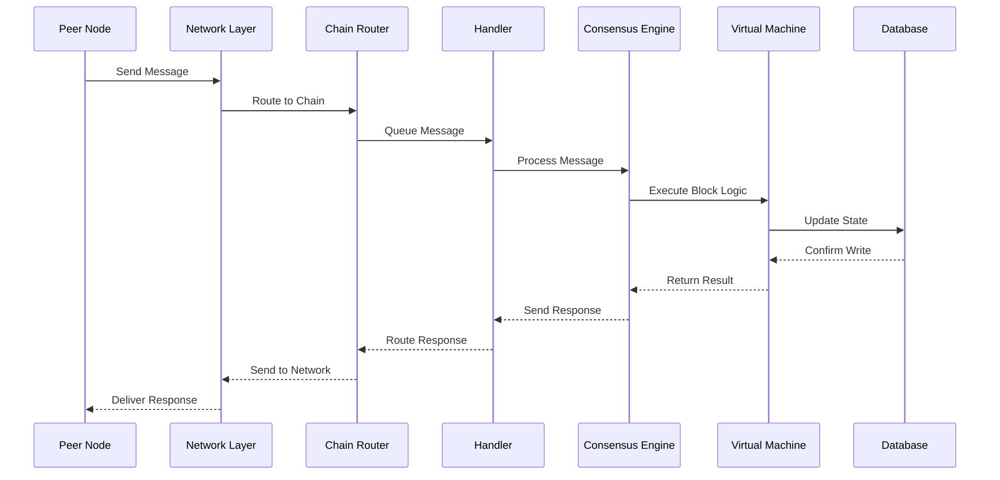

### Consensus Process (Proses Konsensus)

1. **Block Proposal (Proposal Blok)**
   ```go
   // VM builds new block
   func (vm *VM) BuildBlock() (snowman.Block, error) {
       // Select transactions from mempool
       txs := vm.mempool.SelectTransactions()
       
       // Create new block
       block := vm.createBlock(txs)
       
       // Validate block locally
       if err := block.Verify(); err != nil {
           return nil, err
       }
       
       return block, nil
   }
   ```

2. **Validator Sampling (Sampling Validator)**
   - Random sample of validators selected
   - Poll sent to sampled validators
   - Responses collected

3. **Decision Making (Pengambilan Keputusan)**
   - Threshold-based acceptance
   - Confidence building over multiple rounds
   - Final decision (accept/reject)

4. **State Update (Update State)**
   - Accepted blocks update chain state
   - Rejected blocks discarded
   - State synchronized across network

### RPC Chain VM Communication

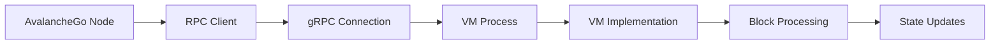

**VM Server Initialization**:
```go
// vms/rpcchainvm/vm_server.go
func (vm *VMServer) Initialize(ctx context.Context, req *vmpb.InitializeRequest) (*vmpb.InitializeResponse, error) {
    // Parse request parameters
    subnetID, err := ids.ToID(req.SubnetId)
    chainID, err := ids.ToID(req.ChainId)
    nodeID, err := ids.ToNodeID(req.NodeId)
    
    // Initialize VM with context
    vmCtx := &snow.Context{
        NetworkID: req.NetworkId,
        SubnetID:  subnetID,
        ChainID:   chainID,
        NodeID:    nodeID,
    }
    
    // Call VM's Initialize method
    return vm.vm.Initialize(ctx, vmCtx, db, req.GenesisBytes, req.UpgradeBytes, req.ConfigBytes, toEngine, fxs, appSender)
}
```

## 🌊 System Flow

### Complete Transaction Flow

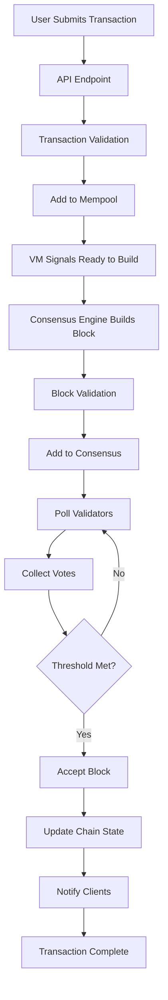

### Network Synchronization Flow


### Subnet Creation and Management Flow

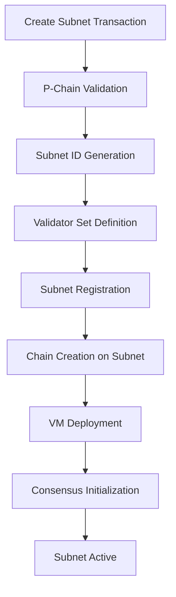

### State Sync Process

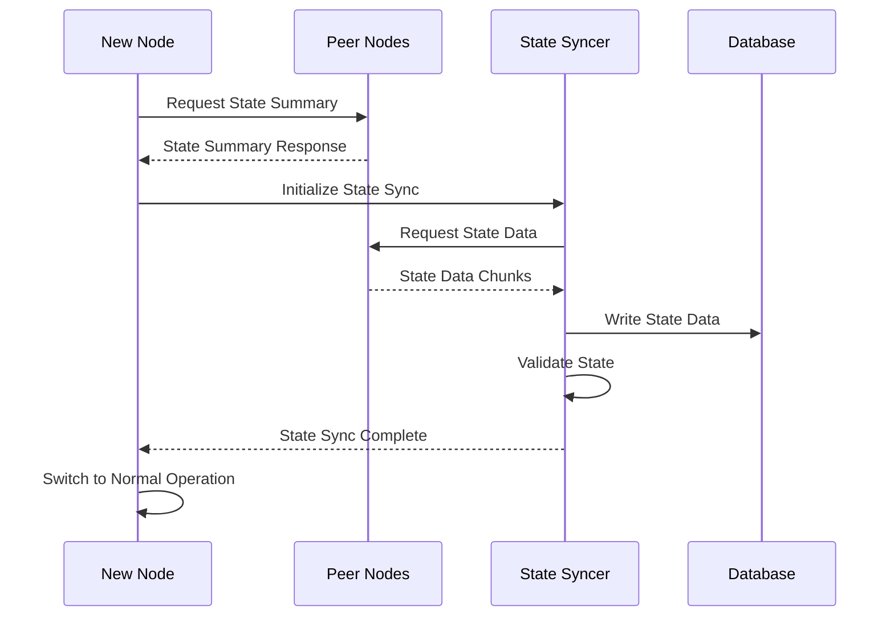

## 📦 Installation

### System Requirements

- **CPU**: Equivalent of 8 AWS vCPU
- **RAM**: 16 GiB
- **Storage**: 1 TiB SSD (recommended)
- **OS**: Ubuntu 22.04/24.04 or macOS >= 12
- **Network**: Reliable IPv4 or IPv6 connection with open public port

### Development Requirements

- [Go](https://golang.org/doc/install) version >= 1.23.9
- [gcc](https://gcc.gnu.org/) and g++
- [Git](https://git-scm.com/)

### Building From Source

```bash
# Clone repository
git clone git@github.com:ava-labs/avalanchego.git
cd avalanchego

# Build binary
./scripts/run_task.sh build

# Run node
./build/avalanchego
```

### Using Package Manager (Ubuntu)

```bash
# Add APT repository
sudo su -
wget -qO - https://downloads.avax.network/avalanchego.gpg.key | tee /etc/apt/trusted.gpg.d/avalanchego.asc
source /etc/os-release && echo "deb https://downloads.avax.network/apt $UBUNTU_CODENAME main" > /etc/apt/sources.list.d/avalanche.list
exit

# Install
sudo apt update
sudo apt install avalanchego
```

### Docker Installation

```bash
# Build image
./scripts/run-task.sh build-image

# Run container
docker run -ti -p 9650:9650 -p 9651:9651 avaplatform/avalanchego:latest /avalanchego/build/avalanchego
```

## 🚀 Running Avalanche

### Connect to Mainnet

```bash
./build/avalanchego
```

### Connect to Fuji Testnet

```bash
./build/avalanchego --network-id=fuji
```

### Create Local Network

```bash
# Using avalanche-cli
avalanche network start
avalanche network status
```

### Configuration Options

Key configuration parameters:

```bash
# Network configuration
--network-id=mainnet|fuji|local
--public-ip=<your-public-ip>
--http-port=9650
--staking-port=9651

# Database configuration
--db-dir=/path/to/database
--db-type=leveldb

# Logging configuration
--log-level=info
--log-dir=/path/to/logs

# Staking configuration (for validators)
--staking-enabled=true
--staking-tls-cert-file=/path/to/cert.crt
--staking-tls-key-file=/path/to/cert.key
```

## 🛠️ Development Guide

### Code Generation

#### Protocol Buffers

```bash
# Install dependencies
go install google.golang.org/protobuf/cmd/protoc-gen-go@v1.33.0
go install google.golang.org/grpc/cmd/protoc-gen-go-grpc@v1.3.0

# Generate protobuf code
./scripts/run-task.sh generate-protobuf
```

#### Mock Generation

```bash
# Generate mocks for testing
./scripts/run-task.sh generate-mocks
```

### Testing

```bash
# Run unit tests
go test ./...

# Run integration tests
./scripts/run-task.sh test-integration

# Run end-to-end tests
./scripts/run-task.sh test-e2e
```

### Creating Custom VMs

1. Implement the `ChainVM` interface
2. Define block structure and validation rules
3. Implement state transition logic
4. Add API endpoints (optional)
5. Register VM with node

Example VM structure:
```go
type MyVM struct {
    ctx       *snow.Context
    db        database.Database
    state     State
    mempool   Mempool
    toEngine  chan<- common.Message
}

func (vm *MyVM) BuildBlock() (snowman.Block, error) {
    // Build block from mempool transactions
    txs := vm.mempool.SelectTransactions()
    block := vm.createBlock(txs)
    return block, nil
}

func (vm *MyVM) ParseBlock(bytes []byte) (snowman.Block, error) {
    // Parse block from bytes
    return vm.parseBlockFromBytes(bytes)
}

func (vm *MyVM) Initialize(ctx *snow.Context, db database.Database, genesisBytes []byte, upgradeBytes []byte, configBytes []byte, toEngine chan<- common.Message, fxs []*common.Fx, appSender common.AppSender) error {
    vm.ctx = ctx
    vm.db = db
    vm.toEngine = toEngine
    
    // Initialize state from genesis
    return vm.initializeState(genesisBytes)
}
```

## 📚 API Documentation

### Health API

```bash
# Check node health
curl -X POST --data '{
    "jsonrpc":"2.0",
    "id"     :1,
    "method" :"health.health"
}' -H 'content-type:application/json;' 127.0.0.1:9650/ext/health
```

### Info API

```bash
# Get node info
curl -X POST --data '{
    "jsonrpc":"2.0",
    "id"     :1,
    "method" :"info.getNodeVersion"
}' -H 'content-type:application/json;' 127.0.0.1:9650/ext/info
```

### Platform API (P-Chain)

```bash
# Get current validators
curl -X POST --data '{
    "jsonrpc": "2.0",
    "method": "platform.getCurrentValidators",
    "params": {},
    "id": 1
}' -H 'content-type:application/json;' 127.0.0.1:9650/ext/P
```

### Contract API (C-Chain)

```bash
# Get balance (Ethereum-compatible)
curl -X POST --data '{
    "jsonrpc":"2.0",
    "method":"eth_getBalance",
    "params":["0x...", "latest"],
    "id":1
}' -H 'content-type:application/json;' 127.0.0.1:9650/ext/bc/C/rpc
```

## 🔒 Security

### Security Features

1. **TLS Encryption**: All network communication encrypted
2. **Signature Verification**: All transactions cryptographically signed
3. **Byzantine Fault Tolerance**: Consensus tolerates up to 1/3 malicious nodes
4. **Staking Requirements**: Economic incentives for honest behavior
5. **Network Isolation**: Subnets provide security boundaries

### Security Best Practices

1. **Key Management**:
   - Store private keys securely
   - Use hardware security modules for validators
   - Regular key rotation

2. **Network Security**:
   - Firewall configuration
   - DDoS protection
   - Regular security updates

3. **Monitoring**:
   - Log analysis
   - Performance monitoring
   - Anomaly detection

### Reporting Security Issues

Please refer to our [Security Policy](SECURITY.md) and [Security Advisories](https://github.com/ava-labs/avalanchego/security/advisories).

## 📊 Monitoring and Metrics

### Built-in Metrics

AvalancheGo exposes Prometheus-compatible metrics:

```bash
# Access metrics endpoint
curl http://localhost:9650/ext/metrics
```

Key metrics to monitor:
- `avalanche_network_peers`: Number of connected peers
- `avalanche_consensus_polls_sent`: Consensus polls sent
- `avalanche_vm_blocks_accepted`: Blocks accepted by VM
- `avalanche_database_reads`: Database read operations

### Health Monitoring

```bash
# Continuous health check
while true; do
  curl -s -X POST --data '{"jsonrpc":"2.0","id":1,"method":"health.health"}' \
    -H 'content-type:application/json;' 127.0.0.1:9650/ext/health | jq
  sleep 30
done
```

## 🔧 Troubleshooting

### Common Issues

1. **Node Not Syncing**:
   - Check network connectivity
   - Verify correct network ID
   - Ensure sufficient disk space

2. **High Memory Usage**:
   - Adjust database cache settings
   - Monitor for memory leaks
   - Consider increasing system RAM

3. **Consensus Issues**:
   - Check validator connectivity
   - Verify staking configuration
   - Monitor consensus metrics

### Debug Mode

```bash
# Run with debug logging
./build/avalanchego --log-level=debug

# Enable specific component debugging
./build/avalanchego --log-level=info --log-display-level=debug
```

## 🤝 Contributing

1. Fork the repository
2. Create feature branch
3. Make changes with tests
4. Submit pull request

See [CONTRIBUTING.md](CONTRIBUTING.md) for detailed guidelines.

## 📄 License

This project is licensed under the BSD 3-Clause License - see the [LICENSE](LICENSE) file for details.

## 🔗 Links

- [Official Website](https://avax.network)
- [Documentation](https://docs.avax.network)
- [Discord Community](https://chat.avax.network)
- [GitHub Issues](https://github.com/ava-labs/avalanchego/issues)
- [Security Advisories](https://github.com/ava-labs/avalanchego/security/advisories)

---

**Note**: This documentation provides a comprehensive overview of the AvalancheGo architecture with detailed code flows and system design. For the most up-to-date information, please refer to the official documentation and source code comments.
